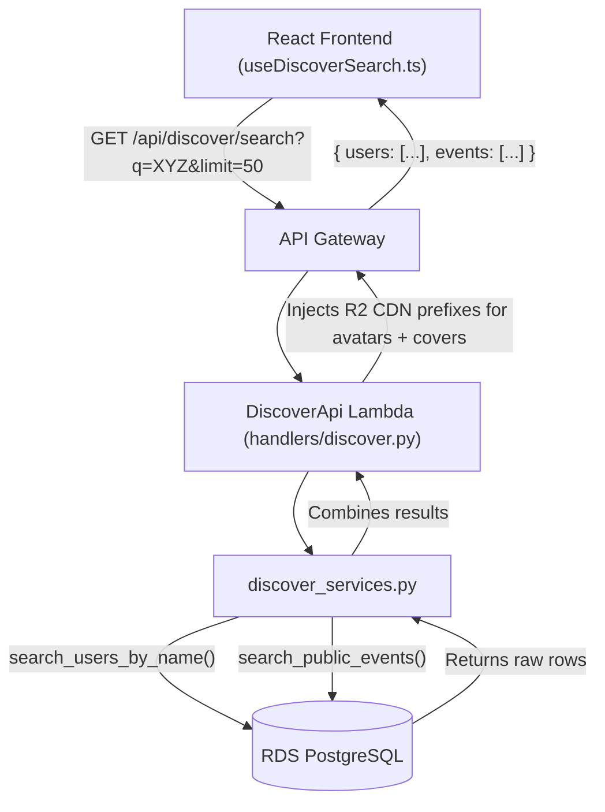

# Discover Search Flow

This document details the architecture and data flow for the HappniX Discover Search experience. The Discover Search is designed to be highly responsive, fetching multiple entity types (Users and Events) through a single unified API endpoint without degrading the performance of the Home Page feed APIs.

## High-Level Architecture

The Discover search relies on a dedicated Lambda function (`DiscoverApi`) mapped to `/api/discover/search`. This separation of concerns ensures that heavy text-based search queries on the RDS database do not consume the concurrency limits of the core `HomePageApi`.



## Frontend Flow (`useDiscoverSearch.ts`)

1. **User Types Query:** The user enters text into the search bar on the Discover page.
2. **Debounce (350ms):** The hook sets a 350ms debounce timer. While the timer is running, the UI shows loading skeletons.
3. **Unified Fetch:** After the debounce, the `useDiscoverSearch` hook sends a single `GET` request to `/api/discover/search?q=<query>&limit=50`.
4. **Data Normalization:** The hook normalizes the API response into `DiscoverItem` interfaces (for Events) and `User` interfaces. It also runs `fixAvatarUrl()` on all image URLs to handle legacy dead CDN URLs (`happnix-dev-new.ronakgo1.workers.dev`) by replacing them with the current R2 public bucket URL.
5. **Progressive Disclosure (local slicing, zero extra API calls):**
   - While typing, only **5 items** per category are displayed.
   - On `Enter` or when typing stops (debounce fires), **10 items** are displayed.
   - If the user clicks **"See More"**, the parent page switches to the dedicated `Users` or `Events` tab and locally unfolds all **50 items** without hitting the API again.

## Backend Services

### 1. `DiscoverApi` Handler (`handlers/discover.py`)
Responsible for parsing the query parameters, invoking the underlying services, and mapping database rows into the JSON format expected by the frontend.
- **Dynamic CDN Injection:** The handler reads the `R2_USERMEDIA_BUCKET_PUBID` environment variable (mapped from `NEXT_PUBLIC_R2_USERMEDIA_BUCKET_PUBID` in SAM). For any raw R2 path (e.g., `public/<uuid>/profile/avatar_123.jpg`), it prepends the CDN base URL before returning the response.
- **Covers:** Event cover images (`coverImageUrl`) are prefixed.
- **User Avatars:** User profile pictures (`profilePictureUrl`) are prefixed.
- **Host Avatars:** The host's profile picture (`host_profilePictureUrl` from the JOIN) is also prefixed and returned as `host_avatar`.

### 2. Service Layer (`services/discover_services.py`)
This service acts as the orchestration layer between the API Handler and the RDS Integration layer. It allows us to process complex business logic — like merging different entity types or calculating relevance scores — without bloating the handler or the database queries.

#### `search_discover_content(query: str, limit_users: int = 50, limit_events: int = 50) -> dict`

**Arguments:**
- `query` (str): The search term entered by the user.
- `limit_users` (int): The maximum number of users to return (Default: 50).
- `limit_events` (int): The maximum number of events to return (Default: 50).

**Returns:**
A dictionary containing a `success` boolean and a `data` dictionary holding arrays of `users` and `events`.

```python
{
    "success": True,
    "data": {
        "users": [...],
        "events": [...]
    }
}
```

**Implementation Details:**
1. Calls `rds.search_users_by_name(query, limit_users)` to fetch users whose `userName` or `fullName` matches the query using an `ILIKE` pattern.
2. Calls `rds.search_public_events(query, limit_events)` to fetch events matching the query.
3. These two calls are made **sequentially** (not concurrently). Each opens its own RDS connection.
4. Merges the results into a single payload. If either query fails, the function will still attempt to return the successful portion (e.g., if events fail, it will return the users).

### 3. Database Layer (`integration/rds.py`)
Provides the actual SQL queries used for the search.

- **`search_users_by_name`**: Uses an `ILIKE` condition on `userName` and `fullName`. Filters:
  - `status = 'Active'` — only active accounts.
  - `privacyMode != 'private'` — private users are excluded from search results.

- **`search_public_events`**: Uses an `ILIKE` condition on `title` and `eventCategory`. Performs an `INNER JOIN` on the `users` table to also fetch the host's `userName` and `profilePictureUrl`. Filters:
  - `visibility != 'Private'` — private events are excluded.
  - `status = 'Published'` — only published events.
  - Host `privacyMode != 'private'` — events from private hosts are excluded.
  - Host `status = 'Active'` — events from deactivated hosts are excluded.
  - Results are ordered by `engagementScore DESC`, then `createdAt DESC`.

## Data Privacy & Security

The Discover Search strictly enforces user privacy at the database layer:
1. **Private Users:** Users who have set their `privacyMode` to `private` will **not** appear in the user search results.
2. **Private Events:** Any event hosted by a private user, regardless of the event's own visibility setting, is omitted from the event search results via the `INNER JOIN` on the `users` table.
3. **Deactivated Accounts:** Users or hosts with `status != 'Active'` are excluded from both user and event results.

## Known Limitations & Future Enhancements
- **Sequential DB calls:** The two RDS queries (`search_users_by_name` + `search_public_events`) each open their own connection. A future optimization would be to share a single connection or combine queries.
- **Elasticsearch/OpenSearch:** For extremely large datasets, the `ILIKE` queries in RDS will become a bottleneck. We plan to migrate the Discover Search to Amazon OpenSearch for fuzzy matching and typo tolerance.
- **Pagination:** Currently limited to 50 items per entity. Future iterations will support cursor-based pagination.
- **Tags Search:** Currently events are searched by `title` and `eventCategory` only. Searching by `tags` would improve discoverability.
