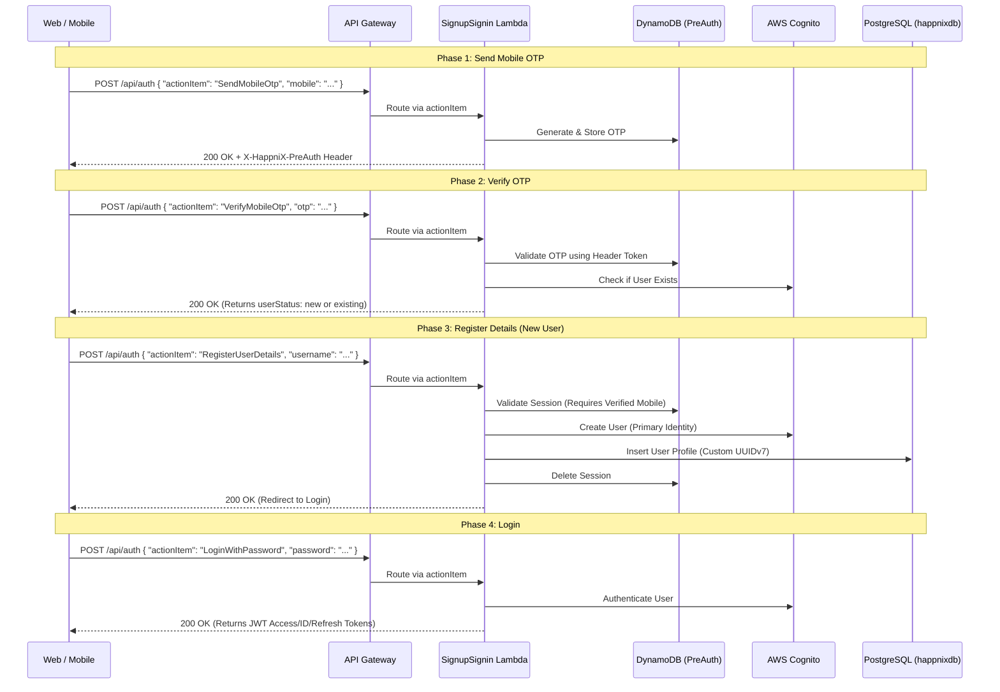

# HappniX Sign-In & Sign-Up Flow Architecture

This document provides a comprehensive developer guide on how the Authentication (Sign-in / Sign-up) flow works behind the scenes in HappniX.

## Overview

The authentication system is a serverless architecture powered by **AWS API Gateway**, **AWS Lambda**, **Amazon Cognito**, **PostgreSQL (RDS)**, and **DynamoDB**.

To simplify the complex state machine of user authentication (e.g., requesting OTPs, verifying them, and collecting user details), HappniX uses a single API route (`POST /api/auth`) with an **Action-Based Routing** pattern. The client sends an `actionItem` in the request body, and the `SignupSignin` Lambda delegates the request to the corresponding Python handler.

## The `X-HappniX-PreAuth` Session

During the sign-up process, before the user is fully created in Cognito and receives a JWT, we need to maintain state (like the OTP sent, verified mobile number, etc.). 
This is handled via a **PreAuth Session**.
1. When a user requests an OTP, a new PreAuth session is created (stored in DynamoDB `HappniX-sessions-v2`).
2. A `token` is returned and passed between the client and server via the `X-HappniX-PreAuth` HTTP header.
3. Once the sign-up or sign-in is complete, the PreAuth session is deleted.

### Architecture Flow Diagram



---

## Detailed Flows

### 1. Send / Resend Mobile OTP
**Action Items:** `SendMobileOtp`, `ResendMobileOtp`

When a user enters their mobile number to sign in or sign up:
1. The client sends a `POST /api/auth` request with `actionItem: "SendMobileOtp"` and the `mobile` number.
2. The Lambda generates a 6-digit OTP using the custom `uuid_generator.py`.
3. The OTP and mobile number are stored in a new or existing PreAuth session.
4. The system sends the OTP to the user's phone via an SMS gateway (e.g., SNS).

**Payload:**
```json
{
  "actionItem": "SendMobileOtp",
  "mobile": "9876543210",
  "region": "IN"
}
```
**Response (200 OK):** `{"success": true, "message": "OTP sent to 9876543210."}`
*(Returns a `X-HappniX-PreAuth` header that the client must store).*

### 2. Verify Mobile OTP
**Action Item:** `VerifyMobileOtp`

The user enters the OTP:
1. The client sends the OTP and mobile number, along with the `X-HappniX-PreAuth` header.
2. The Lambda checks the session in DynamoDB to ensure the OTP matches.
3. If valid, the system checks **both Amazon Cognito and RDS** to see if the user already exists.
   - **Existing User:** The session is cleared, and the client is instructed to proceed to the password login screen.
   - **New User:** The verified mobile number is saved in the PreAuth session, and the client is instructed to proceed to the sign-up details screen.

**Payload:**
```json
{
  "actionItem": "VerifyMobileOtp",
  "mobile": "9876543210",
  "otp": "123456"
}
```
**Response (200 OK):** `{"success": true, "userStatus": "existing" | "new", "message": "..."}`

### 3. Register User Details (Sign Up)
**Action Item:** `RegisterUserDetails`

For new users, after verifying the OTP, they provide their profile details (Username, Full Name, DOB, Gender, Email, Password).
1. The client sends these details along with the `X-HappniX-PreAuth` header (which proves they verified their phone).
2. The Lambda validates all fields (e.g., strong password, valid age).
3. It checks RDS to ensure the `userName` and `emailAddress` are strictly unique.
4. It generates a **Custom UUIDv7** (see below) for the `userID`.
5. It creates the user in **Amazon Cognito** as the primary identity store.
6. It inserts the user's full profile into **RDS PostgreSQL** (`happnixdb`).
   - If RDS insertion fails, it rolls back by deleting the Cognito user to prevent zombie accounts.
7. The PreAuth session is deleted, and the user is redirected to the login page.

**Payload:**
```json
{
  "actionItem": "RegisterUserDetails",
  "username": "ronak",
  "fullName": "Ronak G",
  "dateOfBirth": "2000-01-01",
  "gender": "Male",
  "email": "user@example.com",
  "password": "StrongPassword123!",
  "mobile": "9876543210",
  "region": "IN"
}
```
**Response (200 OK):** `{"success": true, "message": "Account created successfully. Please sign in.", "redirectUrl": "/login.html"}`

### 4. Login With Password
**Action Item:** `LoginWithPassword`

Once registered (or if the user already existed), they log in:
1. The client sends the `identifier` (username, email, or phone) and `password`.
2. The Lambda calls `cognito.authenticate_user()`.
3. Cognito validates the password and returns standard JWTs (Access Token, ID Token, Refresh Token).
4. (Behind the scenes, a `CognitoPreToken` trigger injects the custom `userID` and `userType` into these JWTs).
5. The Lambda returns the tokens to the client. The client stores them (e.g., in localStorage or cookies) and uses them as `Bearer` tokens for all subsequent protected API calls (like `/api/profile/me` or `/api/events`).

**Payload:**
```json
{
  "actionItem": "LoginWithPassword",
  "identifier": "ronak",
  "password": "StrongPassword123!"
}
```
**Response (200 OK):** `{"success": true, "accessToken": "...", "idToken": "...", "refreshToken": "...", "expiresIn": 3600, ...}`

### 5. Account Deletion
**Action Item:** `deleteAccount`

When a user chooses to delete their account:
1. The client sends a `POST /api/profile/me` request with `actionItem: "deleteAccount"` and the `Authorization: Bearer` header.
2. The Lambda routes this to the `delete_account` handler.
3. The service completely wipes the user's data across all storage layers instantly to comply with data privacy policies:
   - Removes files from **R2 Storage** (Public and Private buckets).
   - Deletes all entities associated with the user in **DynamoDB**.
   - Removes the user record from **RDS PostgreSQL**.
   - Deletes the identity from **Amazon Cognito**.
4. The user is logged out and the account is permanently removed.

**Payload:**
```json
{
  "actionItem": "deleteAccount"
}
```
**Response (200 OK):** `{"success": true, "message": "Account has been successfully deleted."}`

---

## The Custom UUIDv7 Architecture

HappniX does not use standard UUIDv4 for user IDs. Instead, it uses a **custom 128-bit UUIDv7** (`utils/uuid_generator.py`) optimized for chronological sorting and embedded metadata.

**Structure:**
- **48-bit UNIX Timestamp:** Ensures IDs are time-ordered. Excellent for database clustering and indexing.
- **12-bit Entity Type (`rand_a`):** Categorizes the ID. For example, `USER -> GENERAL` = `0xA0C`.
- **8-bit Region Code:** Identifies the user's origin country (e.g., India = `1`).
- **10-bit Worker ID:** Prevents collisions when scaling horizontally across Lambda instances.
- **44-bit Randomness:** Cryptographic randomness for security.

When a user signs up, the system generates their `userID` using this UUIDv7 generator, guaranteeing a scalable, indexable, and conflict-free primary key across both PostgreSQL and DynamoDB.
