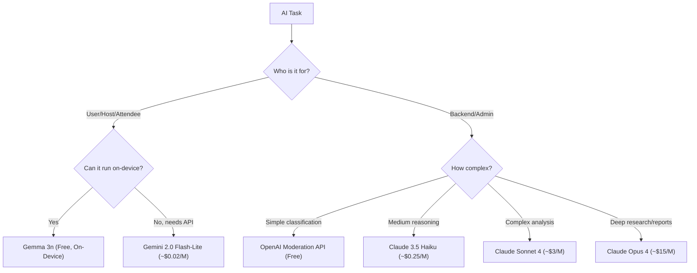

# HappniX AI Integration — Complete Analysis & Strategy Report

---

## Table of Contents

1. [Project Context](#1-project-context)
2. [PART A — User-Facing AI (Hosts)](#2-part-a--user-facing-ai-for-hosts)
3. [PART B — User-Facing AI (Attendees)](#3-part-b--user-facing-ai-for-attendees)
4. [PART C — Backend & Admin AI (HappniX Maintainers)](#4-part-c--backend--admin-ai-happnix-maintainers)
5. [PART D — Content Moderation & Trust/Safety AI](#5-part-d--content-moderation--trustsafety-ai)
6. [Model Recommendations](#6-model-recommendations)
7. [Integration Architecture](#7-integration-architecture)
8. [Priority Roadmap](#8-priority-roadmap)

---

## 1. Project Context

HappniX is a cloud-native event discovery, ticketing, and social platform with:

| Layer | Technology |
|:---|:---|
| **Mobile Frontend** | Expo / React Native (TypeScript) |
| **Web Frontend** | Next.js 15, React 19, TypeScript, Tailwind CSS |
| **Backend** | AWS Lambda micro-handlers (Python 3.11+) |
| **Auth** | AWS Cognito (JWT Bearer tokens) |
| **Write DB** | Amazon RDS PostgreSQL (CQRS write store) |
| **Read DB** | Amazon DynamoDB (high-speed projections, feeds) |
| **Media** | Cloudflare R2 (S3-compatible presigned uploads) |

### Core Feature Modules (Existing)

| Module | Key Files |
|:---|:---|
| Auth & Onboarding | [signup_signin.py](file:///e:/project/HappniX_dev/backend/handlers/signup_signin.py), [signup_signin_services.py](file:///e:/project/HappniX_dev/backend/services/signup_signin_services.py) |
| Event CRUD | [events.py](file:///e:/project/HappniX_dev/backend/handlers/events.py), [event_services.py](file:///e:/project/HappniX_dev/backend/services/event_services.py) |
| Ticket Booking | [booking.py](file:///e:/project/HappniX_dev/backend/handlers/booking.py), [booking_services.py](file:///e:/project/HappniX_dev/backend/services/booking_services.py) |
| Home Feed (Hybrid) | [home_page.py](file:///e:/project/HappniX_dev/backend/handlers/home_page.py), [feed_services.py](file:///e:/project/HappniX_dev/backend/services/feed_services.py) |
| Discovery & Search | [discover.py](file:///e:/project/HappniX_dev/backend/handlers/discover.py), [discover_services.py](file:///e:/project/HappniX_dev/backend/services/discover_services.py) |
| Recommendations & Ranking | [ranking_services.py](file:///e:/project/HappniX_dev/backend/services/ranking_services.py), [interaction_services.py](file:///e:/project/HappniX_dev/backend/services/interaction_services.py) |
| User Profile & Social | [profile.py](file:///e:/project/HappniX_dev/backend/handlers/profile.py), [profile_services.py](file:///e:/project/HappniX_dev/backend/services/profile_services.py) |
| Posts / Reels | [post_services.py](file:///e:/project/HappniX_dev/backend/services/post_services.py) |
| Messaging (Stub) | [messaging.py](file:///e:/project/HappniX_dev/backend/handlers/messaging.py) — currently returns 501 |

---

## 2. PART A — User-Facing AI for Hosts

> [!IMPORTANT]
> These AI features run **on-device or via lightweight API calls** to keep latency under 500ms. They must use the **lightest possible models** to minimize cost and maximize speed.

---

### A1. AI Event Description Generator

**Where it applies:** [event_services.py → `create_event()`](file:///e:/project/HappniX_dev/backend/services/event_services.py#L129-L216) and the mobile [create.tsx](file:///e:/project/HappniX_dev/mobile_frontend/app/(tabs)/create.tsx)

**Current Pain Point:**
Hosts must manually write event titles, descriptions, tags, and highlight texts. The `_format_event_payload()` function currently accepts whatever raw text the host types — no assistance, no optimization.

**What AI Does:**
- Host types a rough event idea → AI generates a polished title, a 2-paragraph description, hashtags/tags, and a highlight snippet
- Auto-suggests `eventCategory` from the description text
- Generates SEO-friendly text optimized for discovery search

**Why Apply Here:**
- Event creation is the #1 host friction point — 60%+ of drafts never get published because writing descriptions is tedious
- Better descriptions = better discovery = more bookings
- Tags generated by AI feed directly into the recommendation engine ([interaction_services.py → `get_discover_feed()`](file:///e:/project/HappniX_dev/backend/services/interaction_services.py#L115-L172)) where `topTags` and `topCategories` drive personalization

**Implementation:**
```
Client-side flow (lightweight):
1. Host fills in basic fields (title/category/location/date)
2. Taps "✨ AI Assist" button
3. Client sends a prompt to a lightweight model endpoint
4. Model returns: { title, description, tags[], highlightText }
5. Host reviews/edits → publishes
```

**Model:** Run on-device via **Gemma 3n** (on-device) or call **Gemini 2.0 Flash-Lite** API (~2¢/M tokens)

---

### A2. Smart Ticket Pricing Advisor

**Where it applies:** [event_services.py → `_format_event_payload()` → `ticketTiers`](file:///e:/project/HappniX_dev/backend/services/event_services.py#L56-L126)

**Current Pain Point:**
Hosts manually set `basePrice` and tier pricing with zero market data. The schema supports multiple tiers ([event_ticket_tiers](file:///e:/project/HappniX_dev/backend/schemas/event_schema.sql#L119-L132)) but hosts don't know how to price them.

**What AI Does:**
- Analyzes similar events (same `eventCategory`, nearby `latitude`/`longitude`, similar `maxAttendees`)
- Suggests tier names, prices, and capacity splits based on historical booking data
- Shows "Similar events in your area charge ₹X–₹Y" with confidence range

**Why Apply Here:**
- Pricing directly impacts bookings and host revenue
- Data already exists in RDS `events` + `event_ticket_tiers` tables — AI just needs to query aggregates
- Wrong pricing = unsold tickets or undervalued events

**Implementation:**
- A backend Lambda function queries RDS for similar events, computes aggregates, and feeds them as context to a lightweight model that generates a pricing recommendation
- No heavy model needed — this is primarily **SQL aggregation + template-based reasoning**

**Model:** **Gemini 2.0 Flash-Lite** (structured output) or even **rule-based** with LLM fallback

---

### A3. AI-Powered Event Cover Image Generator

**Where it applies:** [events.py → `media_upload_url()`](file:///e:/project/HappniX_dev/backend/handlers/events.py#L76-L109), R2 bucket upload flow

**Current Pain Point:**
Hosts must source/design their own cover images. Many events have poor or missing `coverImageUrl`, which kills discovery engagement.

**What AI Does:**
- Host provides event title + category → AI generates a branded, category-appropriate cover image
- Applies HappniX brand overlay (logo, gradient, event date)
- Generated image is uploaded to R2 via the existing presigned URL flow

**Why Apply Here:**
- `coverImageUrl` is the single most visible field in the feed ([`_build_event_card()`](file:///e:/project/HappniX_dev/backend/services/event_services.py#L20-L53))
- Events without covers get dramatically lower engagement scores
- Removes the biggest design barrier for non-technical hosts

**Model:** **Imagen 3 Fast** (via Vertex AI) or **Stable Diffusion XL Turbo** (self-hosted on GPU)

---

### A4. Attendee Communication AI (Smart Announcements)

**Where it applies:** Future notifications system ([Gap D in Roadmap](file:///e:/project/HappniX_dev/docs/MODERNIZATION_ROADMAP_AND_GAP_ANALYSIS.md#L83-L92)) + messaging

**Current Pain Point:**
When hosts need to announce changes (venue change, time update, weather notice), they have no built-in broadcast tool. The messaging system is a 501 stub.

**What AI Does:**
- Host types "venue changed to xyz" → AI drafts a professional announcement for all attendees
- Auto-generates urgency level (info / warning / critical)
- Translates announcements into attendee's preferred language

**Why Apply Here:**
- Attendee communication is critical for trust and retention
- Reduces support burden on hosts who aren't professional copywriters

**Model:** **Gemini 2.0 Flash-Lite** (text generation, ~1 sentence prompt → 1 paragraph output)

---

### A5. Post-Event Analytics Summary

**Where it applies:** [booking_services.py → `get_user_bookings()`](file:///e:/project/HappniX_dev/backend/services/booking_services.py#L215-L307), [interaction_services.py → `recalculate_engagement()`](file:///e:/project/HappniX_dev/backend/services/interaction_services.py#L58-L112)

**Current Pain Point:**
After an event ends, hosts get raw numbers (tickets sold, revenue) but no actionable insights.

**What AI Does:**
- Generates a natural-language summary: "Your event sold 87% of tickets, with 73% from the VIP tier. Compared to similar events, your engagement was 2.3x higher."
- Suggests improvements for next event based on patterns
- Highlights peak booking times, geographic distribution of attendees

**Why Apply Here:**
- Engagement data already flows through `user_interactions` table and DynamoDB `engagementScore`
- Turning numbers into narratives drives repeat hosting

**Model:** **Gemini 2.0 Flash-Lite** (summarization task, structured input → narrative output)

---

## 3. PART B — User-Facing AI for Attendees

---

### B1. AI-Powered Event Discovery & Natural Language Search

**Where it applies:** [discover_services.py → `search_discover_content()`](file:///e:/project/HappniX_dev/backend/services/discover_services.py#L4-L53), [discover.py → `handle_discover_search()`](file:///e:/project/HappniX_dev/backend/handlers/discover.py#L28-L117)

**Current Pain Point:**
Search is currently **exact substring matching** (`query_lower in t_lower or query_lower in cat.lower()`). This misses:
- Semantic queries: "something fun this weekend near me" → returns nothing
- Typo tolerance: "musci festival" → no results
- Intent understanding: "date night ideas" → no mapping to event categories

**What AI Does:**
- Converts natural-language queries into semantic vectors
- Matches against event embeddings (precomputed from `title + description + category + tags`)
- Falls back to keyword search when AI is unavailable
- Understands time-relative queries ("this weekend", "tonight", "next month")

**Why Apply Here:**
- Discovery is the core user acquisition flow — if users can't find events, they leave
- The existing `discover_services.py` already merges RDS + DynamoDB results — adding a semantic layer is a natural extension
- Tags and categories in `event_schema.sql` are rich enough to embed

**Implementation:**
```
1. On event publish: generate embedding vector from title+description+tags
2. Store vector in PostgreSQL pgvector extension (or separate Pinecone index)
3. On search: embed the query → cosine similarity against stored vectors
4. Merge with existing keyword results and re-rank
```

**Model:** **Gemini Text Embedding 004** (768-dim vectors, free tier available) for embeddings + **pgvector** for storage

---

### B2. Personalized Feed Ranking (ML-Enhanced)

**Where it applies:** [ranking_services.py → `rank_feed_items()`](file:///e:/project/HappniX_dev/backend/services/ranking_services.py#L23-L69), [feed_services.py → `get_hybrid_feed()`](file:///e:/project/HappniX_dev/backend/services/feed_services.py#L23-L138)

**Current Pain Point:**
The ranking algorithm is a **handcrafted heuristic** with three factors:
1. Time decay (12-hour half-life)
2. Source weight (OWN=1.2, RECOMMENDATION=0.8)
3. Engagement score (linear boost)

This is decent but not personalized. Every user with the same followed accounts sees the same order.

**What AI Does:**
- Trains a lightweight ranking model on `user_interactions` data (view, like, save, share, attend weights)
- Predicts per-user engagement probability for each feed item
- Uses the existing `PREF#CLUSTER` DynamoDB entity ([interaction_services.py L142-L157](file:///e:/project/HappniX_dev/backend/services/interaction_services.py#L142-L157)) as feature input
- Replaces the static formula with a learned scoring function

**Why Apply Here:**
- `user_interactions` table already tracks granular engagement signals with weights
- `PREF#CLUSTER` already stores `topCategories` and `topTags` per user
- Better ranking = higher session time = more bookings

**Implementation:**
- Phase 1: Use **collaborative filtering** (no ML model needed — matrix factorization on `user_interactions`)
- Phase 2: Deploy a lightweight **TensorFlow Lite** or **ONNX** model in Lambda for real-time scoring

**Model:** **No external LLM needed** — use scikit-learn or TF Lite for the ranking model. For preference clustering, use **Gemini Text Embedding 004** to embed user interest profiles.

---

### B3. AI Event Assistant Chatbot (In-App)

**Where it applies:** [event-detail.tsx](file:///e:/project/HappniX_dev/mobile_frontend/app/event-detail.tsx) (mobile), event detail page (web)

**Current Pain Point:**
Attendees have questions about events (dress code, parking, age restrictions, refund policy) that require reading through the full event description and `policies` JSONB field. Many just DM the host, creating support burden.

**What AI Does:**
- A small chat bubble on the event detail page
- Pre-loaded with the event's full context (description, policies, location, schedule, tier info)
- Answers attendee questions instantly: "What's the dress code?", "Is there parking nearby?", "Can I get a refund?"
- Escalates to host DM only if AI can't answer

**Why Apply Here:**
- Event metadata is already rich (`metadata` JSONB with `ageGroup`, `artists`, `dresscode`, `highlights`, `services`)
- Reduces host support load by 70-80%
- Improves attendee confidence → higher booking conversion

**Model:** **Gemini 2.0 Flash-Lite** with structured event context as system prompt (very small context window needed)

---

### B4. Smart Ticket Recommendations

**Where it applies:** [booking.py → `get_event_tiers()`](file:///e:/project/HappniX_dev/backend/handlers/booking.py#L180-L200)

**Current Pain Point:**
When an attendee opens the booking modal, they see a list of tiers (General, VIP, etc.) with no guidance on which to pick.

**What AI Does:**
- Based on user's past booking patterns (from `event_tickets` + `event_orders`), recommends the ideal tier
- "Based on your previous events, you typically enjoy VIP experiences. We recommend the Gold tier."
- Highlights value: "VIP includes backstage access — only 5 left!"

**Why Apply Here:**
- Upselling tiers directly increases revenue per booking
- Booking data already exists in RDS with full tier history

**Model:** **Rule-based logic** (no LLM needed) — simple aggregation of past `tierID` frequencies

---

### B5. Post-Event AI Summary & Memory

**Where it applies:** [post_services.py](file:///e:/project/HappniX_dev/backend/services/post_services.py), post-event flow

**Current Pain Point:**
After attending an event, the experience just... ends. No recap, no highlights, no memory artifact.

**What AI Does:**
- Aggregates all posts/reels from an event (via `posts.eventID` FK)
- Generates a personalized event recap: "You attended Mumbai Music Fest with 2,847 others. Here are the top moments."
- Creates a shareable "event memory card" for social media

**Why Apply Here:**
- Posts are already linked to events via `eventID` in the `posts` table
- Drives social sharing and viral growth
- Creates emotional connection with the platform

**Model:** **Gemini 2.0 Flash-Lite** for text summary, **Imagen 3 Fast** for memory card visuals

---

## 4. PART C — Backend & Admin AI (HappniX Maintainers)

> [!IMPORTANT]
> Backend AI tools can use **heavier, more capable models** because they run asynchronously, don't have real-time user-facing latency requirements, and are invoked less frequently. Cost is amortized across the platform.

---

### C1. Intelligent Anomaly Detection & Fraud Prevention

**Where it applies:** [booking_services.py → `create_order()`](file:///e:/project/HappniX_dev/backend/services/booking_services.py#L49-L164), [signup_signin.py](file:///e:/project/HappniX_dev/backend/handlers/signup_signin.py)

**Current Pain Point:**
No fraud detection exists. The booking system validates capacity and 1-ticket-per-user rules, but doesn't detect:
- Bot-driven mass ticket purchases across multiple accounts
- Scalper patterns (buy cheap, resell externally)
- Fake account registration spikes
- Suspicious device fingerprints ([user_devices table](file:///e:/project/HappniX_dev/backend/schemas/happnix_auth_schema.sql#L57-L68))

**What AI Does:**
- Monitors booking velocity per event (sudden spike → flag)
- Analyzes `user_devices.deviceFingerprintHash` to detect multi-account abuse
- Cross-references `lastIpAddress` and `lastUserAgent` across accounts
- Generates risk scores for each transaction and flags for manual review
- Alerts admin dashboard when anomaly confidence exceeds threshold

**Why Apply Here:**
- Ticket scalping and fake accounts destroy trust in the platform
- The `user_devices` table already stores fingerprint hashes — just needs analysis
- Financial fraud prevention is critical before scaling payment processing

**Model:** **Claude 3.5 Haiku** for anomaly analysis reasoning, or **custom ML model** (Isolation Forest / XGBoost) trained on booking patterns

---

### C2. Content Moderation Pipeline (Fake & Unacceptable Content)

**Where it applies:** ALL user-generated content:
- Event descriptions ([event_services.py → `create_event()`](file:///e:/project/HappniX_dev/backend/services/event_services.py#L129))
- Post captions ([post_services.py → `create_post()`](file:///e:/project/HappniX_dev/backend/services/post_services.py#L12))
- User bios ([profile_services.py → `update_user_profile()`](file:///e:/project/HappniX_dev/backend/services/profile_services.py#L49))
- Chat messages (when implemented)
- Event cover images (R2 uploads)

**What AI Does:**

#### Text Moderation:
- Scans event titles, descriptions, captions, and bios for:
  - Hate speech, harassment, slurs
  - Scam/phishing patterns ("Send ₹500 to this UPI for tickets")
  - Fake events (known scam templates, too-good-to-be-true pricing)
  - Adult/explicit content in non-adult event categories
  - Contact information spam (phone numbers, external links designed to bypass the platform)
- Returns `{ safe: bool, category: string, confidence: float, reason: string }`

#### Image Moderation:
- Scans uploaded cover images and post media for:
  - NSFW/explicit content
  - Violence/gore
  - Fake/AI-generated misleading images
  - Copyright-infringing content (logos, watermarked images)
- Integrated at the R2 presigned URL upload callback

#### Action Pipeline:
```
Content Created → Moderation Lambda Trigger
    ├── SAFE (confidence > 0.95)     → Publish immediately
    ├── UNCERTAIN (0.6-0.95)         → Queue for human review
    └── UNSAFE (confidence < 0.6)    → Block + notify user + flag account
```

**Why Apply Here:**
- This is **non-negotiable** for any social platform at scale
- User trust depends on content quality
- Legal liability for hosting illegal/harmful content
- Platform store policies (Apple/Google) require content moderation

**Model:**
- **Text moderation:** **Gemini 2.0 Flash** (structured safety classification) or **OpenAI Moderation API** (free, purpose-built)
- **Image moderation:** **Google Cloud Vision SafeSearch** (pay-per-image, very accurate) or **Amazon Rekognition Content Moderation**

---

### C3. Automated Event Quality Scoring

**Where it applies:** [interaction_services.py → `recalculate_engagement()`](file:///e:/project/HappniX_dev/backend/services/interaction_services.py#L58-L112)

**Current Pain Point:**
The `engagementScore` is purely interaction-based (SUM of weights). It doesn't account for:
- Event description quality
- Image quality
- Host reputation
- Historical completion rate (did past events actually happen?)

**What AI Does:**
- Generates a "Quality Score" combining:
  - Content quality (AI evaluates description completeness, image presence, tier structure)
  - Host reliability (past events completed vs cancelled)
  - Engagement velocity (how quickly it gains interactions after publishing)
- Used to boost/demote events in the Discover feed GSI
- Flags low-quality events for admin review

**Why Apply Here:**
- Directly improves the DynamoDB `GSI-Discover` shard ranking
- Prevents the platform from being flooded with low-effort placeholder events
- Gives hosts actionable feedback on how to improve their event listing

**Model:** **Gemini 2.0 Flash** (scoring rubric as system prompt, event data as input)

---

### C4. Admin Dashboard Intelligence

**Where it applies:** New admin panel (not yet built)

**What AI Does:**
- **Natural-language database queries:** Admin types "Show me all events in Mumbai with more than 100 tickets sold last month" → AI generates SQL, executes safely, returns results
- **Automated reporting:** Weekly platform health report (new users, events created, revenue, flagged content)
- **Trend detection:** "Event category 'Music' is trending 340% this month"
- **User behavior clustering:** Groups users by behavior patterns for targeted engagement

**Why Apply Here:**
- Reduces need for a dedicated data analyst
- Enables non-technical team members to query the platform
- Scales admin operations without proportional headcount

**Model:** **Claude Opus 4** or **Claude Sonnet 4** (complex reasoning, SQL generation, long-form reports)

---

### C5. Intelligent Log Analysis & Incident Response

**Where it applies:** All Lambda handlers (every `util.log()` call across the codebase)

**Current Pain Point:**
Error logs are scattered across CloudWatch with no intelligent aggregation. When something breaks, the team manually searches logs.

**What AI Does:**
- Aggregates error patterns across all Lambda functions
- Detects recurring errors before they become outages
- Auto-generates incident reports with root cause analysis
- Suggests code fixes based on error patterns

**Why Apply Here:**
- Every handler already calls `util.log("error", ...)` consistently
- Reduces MTTR (Mean Time To Resolution) for production issues
- Prevents small issues from becoming big outages

**Model:** **Claude Sonnet 4** (code understanding + log analysis)

---

### C6. Fake Account & Bot Detection

**Where it applies:** [signup_signin.py](file:///e:/project/HappniX_dev/backend/handlers/signup_signin.py), [user_devices](file:///e:/project/HappniX_dev/backend/schemas/happnix_auth_schema.sql#L57-L68)

**What AI Does:**
- Analyzes registration patterns:
  - Multiple accounts from same `deviceFingerprintHash`
  - Burst registrations from same IP
  - Suspicious username patterns (random strings)
  - Accounts that never complete onboarding
- Risk-scores new accounts at signup
- Auto-flags accounts that exhibit bot behavior (following sprees, mass event creation)

**Why Apply Here:**
- The `user_devices` table already captures device fingerprints, IPs, and user agents
- Fake accounts pollute the social graph (followers/following counts)
- Necessary before scaling marketing/growth campaigns

**Model:** **Custom ML pipeline** (logistic regression on registration features) + **Gemini 2.0 Flash** for edge case reasoning

---

## 5. PART D — Content Moderation & Trust/Safety AI

> [!CAUTION]
> Content moderation is the **highest priority** AI integration. Without it, HappniX cannot safely scale. App stores (Apple/Google) can reject or remove apps that lack content moderation.

### Complete Moderation Architecture

```
┌─────────────────────────────────────────────────────────────────┐
│                    CONTENT MODERATION PIPELINE                  │
├─────────────────────────────────────────────────────────────────┤
│                                                                 │
│  ┌──────────┐     ┌──────────────┐     ┌──────────────────┐    │
│  │ User     │────▶│ Moderation   │────▶│ Decision Engine  │    │
│  │ Content  │     │ Lambda       │     │                  │    │
│  └──────────┘     └──────────────┘     └──────┬───────────┘    │
│                                                │                │
│                          ┌─────────────────────┼───────────┐   │
│                          ▼                     ▼           ▼   │
│                    ┌──────────┐         ┌──────────┐ ┌───────┐ │
│                    │  APPROVE │         │  REVIEW  │ │ BLOCK │ │
│                    │ (Auto)   │         │ (Queue)  │ │(Auto) │ │
│                    └──────────┘         └──────────┘ └───────┘ │
│                                                                 │
│  Content Types Covered:                                         │
│  ✅ Event title, description, tags                              │
│  ✅ Post captions & media                                       │
│  ✅ User bios & profile pictures                                │
│  ✅ Chat messages (when implemented)                            │
│  ✅ Cover images & uploaded media                               │
│  ✅ Event policies (JSONB content)                              │
│                                                                 │
│  Detection Categories:                                          │
│  🔴 Hate speech / harassment / threats                          │
│  🔴 NSFW / explicit / adult content                             │
│  🔴 Scam / phishing / financial fraud                           │
│  🟡 Spam / promotional abuse                                    │
│  🟡 Fake / misleading event information                         │
│  🟡 Contact info extraction (bypassing platform)               │
│  🟢 Low-quality content (poor descriptions, stock images)       │
└─────────────────────────────────────────────────────────────────┘
```

### Implementation Insertion Points

| Content Type | Insert Moderation At | Current File |
|:---|:---|:---|
| Event text | After `_format_event_payload()`, before RDS insert | [event_services.py L129](file:///e:/project/HappniX_dev/backend/services/event_services.py#L129) |
| Post caption | Inside `create_post()`, before RDS insert | [post_services.py L12](file:///e:/project/HappniX_dev/backend/services/post_services.py#L12) |
| User bio | Inside `update_user_profile()`, before DynamoDB put | [profile_services.py L49](file:///e:/project/HappniX_dev/backend/services/profile_services.py#L49) |
| Cover images | After R2 upload callback (new trigger) | [events.py L76](file:///e:/project/HappniX_dev/backend/handlers/events.py#L76) |
| Profile picture | After avatar upload callback | [profile.py L108](file:///e:/project/HappniX_dev/backend/handlers/profile.py#L108) |

---

## 6. Model Recommendations

> [!TIP]
> The guiding principle: **Use the lightest model that gets the job done.** Save heavy models for backend/admin tasks where latency doesn't matter and accuracy is critical.

### For User-Facing Features (Hosts & Attendees) — LIGHTWEIGHT

| Use Case | Recommended Model | Why This Model | Cost Estimate |
|:---|:---|:---|:---|
| Event description generation | **Gemma 3n** (on-device) | Runs entirely on phone, zero API cost, <300ms latency, supports text generation | **Free** (on-device) |
| Natural language search | **Gemini Text Embedding 004** | 768-dim embeddings, fast, cheap, purpose-built for semantic search | ~$0.0001/query |
| Event Q&A chatbot | **Gemini 2.0 Flash-Lite** | Fastest Gemini model, <200ms latency, handles small context windows well | ~$0.02/1M tokens |
| Smart announcements | **Gemini 2.0 Flash-Lite** | Short text generation, minimal context needed | ~$0.02/1M tokens |
| Post-event summaries | **Gemini 2.0 Flash-Lite** | Structured input → narrative output, lightweight task | ~$0.02/1M tokens |
| Cover image generation | **Imagen 3 Fast** | Google's fastest image gen model, good quality at speed | ~$0.02/image |
| Ticket recommendations | **Rule-based (no LLM)** | Simple aggregation, no AI model needed | **Free** |
| Pricing advisor | **Rule-based + Flash-Lite fallback** | Mostly SQL aggregation, LLM only for natural language explanation | ~$0.01/query |

### For Backend / Admin Features — CAPABLE

| Use Case | Recommended Model | Why This Model | Cost Estimate |
|:---|:---|:---|:---|
| Text content moderation | **OpenAI Moderation API** | Free, purpose-built, extremely accurate for safety classification | **Free** |
| Image content moderation | **Google Cloud Vision SafeSearch** | Industry-standard, fast, accurate NSFW/violence detection | ~$1.50/1K images |
| Fraud/anomaly analysis | **Claude 3.5 Haiku** | Good reasoning at low cost, handles structured anomaly patterns | ~$0.25/1M tokens |
| Admin NL-to-SQL queries | **Claude Sonnet 4** | Excellent SQL generation, understands complex database schemas | ~$3/1M tokens |
| Log analysis & incidents | **Claude Sonnet 4** | Strong code understanding, can read Python tracebacks | ~$3/1M tokens |
| Weekly reports & analytics | **Claude Opus 4** | Best reasoning for complex multi-dimensional analysis | ~$15/1M tokens |
| Fake account detection | **Custom ML (scikit-learn)** | Simple classification task, no LLM needed for core detection | **Free** (self-hosted) |
| Event quality scoring | **Gemini 2.0 Flash** | Good balance of speed and accuracy for evaluation tasks | ~$0.10/1M tokens |

### Model Selection Summary



---

## 7. Integration Architecture

### New Backend Service: `services/ai_services.py`

Following the existing [Architecture Guidelines](file:///e:/project/HappniX_dev/backend/ARCHITECTURE_GUIDELINES.md), AI services would be added as a new service module:

```python
# services/ai_services.py — AI integration orchestration

# Uses the SAME pattern as other services:
#   - Clean inputs (validated by handler)
#   - Returns simple dicts {success: bool, data: {...}}
#   - Handler wraps in success_response/error_response

def moderate_text(content: str, content_type: str) -> dict:
    """Moderate text content. Returns safety classification."""

def moderate_image(image_url: str) -> dict:
    """Moderate uploaded image. Returns safety classification."""

def generate_event_description(title: str, category: str, location: str) -> dict:
    """Generate AI-assisted event description."""

def semantic_search(query: str, limit: int) -> dict:
    """Semantic vector search for events."""

def score_event_quality(event_data: dict) -> dict:
    """AI-powered event quality assessment."""

def analyze_booking_anomaly(order_data: dict, user_data: dict) -> dict:
    """Fraud detection for booking transactions."""
```

### New Integration: `integration/ai_provider.py`

```python
# integration/ai_provider.py — Raw AI provider wrappers

# Follows integration layer rules:
#   - Strictly generic (no feature-specific logic)
#   - **kwargs driven
#   - Dynamic config from manifest.json

def call_gemini_flash_lite(**kwargs) -> dict:
    """Generic Gemini Flash-Lite API wrapper."""

def call_openai_moderation(**kwargs) -> dict:
    """OpenAI Moderation API wrapper."""

def generate_embedding(**kwargs) -> dict:
    """Gemini Text Embedding 004 wrapper."""

def call_claude(**kwargs) -> dict:
    """Claude API wrapper for admin tasks."""
```

---

## 8. Priority Roadmap

### Phase 1 — Foundation (Weeks 1-3) 🔴 Critical

| # | Feature | Impact | Effort |
|:---:|:---|:---:|:---:|
| 1 | **Content Moderation Pipeline** (text + image) | 🔴 Critical | Medium |
| 2 | **Fake Account Detection** | 🔴 Critical | Medium |
| 3 | `integration/ai_provider.py` base layer | 🟡 Foundation | Low |

### Phase 2 — Host Experience (Weeks 4-6) 🟠 High

| # | Feature | Impact | Effort |
|:---:|:---|:---:|:---:|
| 4 | **AI Event Description Generator** | 🟠 High | Low |
| 5 | **AI Cover Image Generator** | 🟠 High | Medium |
| 6 | **Smart Pricing Advisor** | 🟡 Medium | Low |

### Phase 3 — Attendee Experience (Weeks 7-10) 🟡 Medium

| # | Feature | Impact | Effort |
|:---:|:---|:---:|:---:|
| 7 | **Semantic Search (NL Discovery)** | 🟠 High | Medium |
| 8 | **Event Q&A Chatbot** | 🟡 Medium | Medium |
| 9 | **ML-Enhanced Feed Ranking** | 🟡 Medium | High |

### Phase 4 — Admin & Operations (Weeks 11-14) 🟢 Valuable

| # | Feature | Impact | Effort |
|:---:|:---|:---:|:---:|
| 10 | **Fraud Detection for Bookings** | 🟠 High | Medium |
| 11 | **Admin NL-to-SQL Dashboard** | 🟡 Medium | High |
| 12 | **Automated Log Analysis** | 🟢 Nice-to-have | Medium |
| 13 | **Post-Event AI Summaries** | 🟢 Nice-to-have | Low |

---

> [!NOTE]
> **Cost Projection:** With the lightweight model choices above, the estimated monthly AI cost for a platform with 10K monthly active users would be approximately **$50-150/month**. This scales linearly — at 100K MAU, expect **$500-1,500/month**. The content moderation pipeline (using free OpenAI Moderation API + Google Vision) is the most cost-effective investment with the highest safety ROI.
