# HappniX Serverless Backend Flow

Here is a flowchart mapping out exactly how requests flow from the frontend through the AWS API Gateway, and down to specific Lambda functions and databases. 

Notice how **Auth** uses a single `POST /api/auth` endpoint and routes internally based on the `actionItem`, whereas other services like **Profiles** and **Events** use traditional RESTful routing (e.g. `GET /api/profile/me`).

```mermaid
flowchart TD
    %% Define Styles
    classDef client fill:#3b82f6,stroke:#1d4ed8,color:white,font-weight:bold,rx:8px
    classDef aws fill:#f97316,stroke:#c2410c,color:white,font-weight:bold,rx:8px
    classDef lambda fill:#8b5cf6,stroke:#5b21b6,color:white,font-weight:bold,rx:8px
    classDef db fill:#10b981,stroke:#047857,color:white,font-weight:bold,rx:8px
    classDef authMethod fill:#f3f4f6,stroke:#d1d5db,color:#374151
    classDef restMethod fill:#fef3c7,stroke:#f59e0b,color:#92400e

    %% Clients
    Browser["🌐 Web App / Browser"]:::client
    Mobile["📱 React Native Mobile App"]:::client

    %% Gateway
    APIGateway["☁️ AWS API Gateway"]:::aws

    %% Connections
    Browser -- "HTTPS/JSON" --> APIGateway
    Mobile -- "HTTPS/JSON" --> APIGateway

    %% ----------------------------------------------------
    %% Auth Flow (Action Item Pattern)
    %% ----------------------------------------------------
    subgraph Auth Stack ["Auth Stack (Action-Based)"]
        AuthRoute["POST /api/auth"]:::restMethod
        SignupSigninLambda["⚙️ SignupSignin.py Lambda"]:::lambda
        
        %% Action Items
        ActionMobile["SendMobileOtp\nVerifyMobileOtp"]:::authMethod
        ActionLogin["LoginWithPassword"]:::authMethod
        ActionProfile["RegisterUserDetails\nCompleteProfileSetup"]:::authMethod
        ActionGov["SendAadhaarOtp\nVerifyAadhaarOtp"]:::authMethod
        ActionDev["GetDevAuthStatus\nWipeDevUsers\nGetDevAllUsers"]:::authMethod
        
        AuthRoute --> SignupSigninLambda
        SignupSigninLambda -. "actionItem" .-> ActionMobile
        SignupSigninLambda -. "actionItem" .-> ActionLogin
        SignupSigninLambda -. "actionItem" .-> ActionProfile
        SignupSigninLambda -. "actionItem" .-> ActionGov
        SignupSigninLambda -. "actionItem" .-> ActionDev
    end

    APIGateway --> AuthRoute

    %% ----------------------------------------------------
    %% Feature Flows (RESTful Pattern)
    %% ----------------------------------------------------
    subgraph Feature Stack ["Feature Stack (RESTful)"]
        ProfilesRoute["/api/profile/*\n/api/users/*"]:::restMethod
        ProfilesLambda["⚙️ profiles_api.py Lambda"]:::lambda
        
        EventsRoute["/api/events/*"]:::restMethod
        EventsLambda["⚙️ events_api.py Lambda"]:::lambda
        
        TicketsRoute["/api/tickets/*"]:::restMethod
        TicketsLambda["⚙️ tickets_api.py Lambda"]:::lambda

        ProfilesRoute --> ProfilesLambda
        EventsRoute --> EventsLambda
        TicketsRoute --> TicketsLambda
    end

    APIGateway --> ProfilesRoute
    APIGateway --> EventsRoute
    APIGateway --> TicketsRoute

    %% ----------------------------------------------------
    %% Data Layer
    %% ----------------------------------------------------
    subgraph Data Layer ["Serverless Data Layer"]
        Cognito["🔐 AWS Cognito\n(Identity & Tokens)"]:::aws
        RDS["🐘 PostgreSQL RDS\n(Core Identity / users table)"]:::db
        DynamoUsers["⚡ DynamoDB: Happnix-userInfoTable\n(Scalable Profiles)"]:::db
        DynamoSessions["⚡ DynamoDB: HappniX-sessions-v2\n(Session & OTP TTL)"]:::db
    end

    %% Wiring Lambdas to Data
    SignupSigninLambda == "Upsert / Query" ==> RDS
    SignupSigninLambda == "Put / Get" ==> DynamoUsers
    SignupSigninLambda == "Set OTP/Session" ==> DynamoSessions
    SignupSigninLambda == "Create User" ==> Cognito

    ProfilesLambda -. "Query" .-> DynamoUsers
    ProfilesLambda -. "Lookup" .-> RDS
    
    EventsLambda -. "Query" .-> DynamoUsers
```

### Breakdown of the Request Patterns

#### 1. The Auth Approach (`actionItem`)
Because Auth involves complex multi-step state machines (e.g. asking for mobile -> getting OTP -> verifying -> registering details), we route all requests to a single `POST /api/auth` endpoint. The Lambda inspects the `actionItem` in the body to decide which python function to run.

#### 2. The Feature Approach (RESTful)
For standard CRUD (Create, Read, Update, Delete) features like Profiles, Events, and Tickets, the API Gateway inspects the URL path and HTTP Method to route directly to specific handlers. For example:
- `GET /api/profile/me` ➡️ Triggers `profiles_api.py` to fetch your own data.
- `GET /api/users/{id}/profile` ➡️ Triggers `profiles_api.py` to fetch someone else's public profile.
- `POST /api/events/create` ➡️ Triggers `events_api.py`.

#### 3. Layered Architecture & Code Organization
The codebase strictly adheres to a separated, layered architecture to maintain clean boundaries between I/O, business logic, and database operations.

- **Handlers (`handlers/`)**: The front door. Handlers extract and validate parameters, handle basic/short logic under the **"10-Line Rule"**, manage `try/except` safety blocks, and format the final HTTP `success_response` / `error_response`.
- **Services (`services/`)**: Orchestrates complex business logic and multi-step workflows (e.g., syncing Cognito with RDS and DynamoDB). Expects clean, validated arguments from handlers.
- **Integrations (`integration/`)**: Generic wrappers for AWS/DB operations (`rds.py`, `cognito_auth.py`, `dynamo_db.py`). Functions are fully generic, accept `**kwargs`, and dynamically rely on `integration/manifest.json` for schema columns and attribute mappings.
