# HappniX Serverless Backend Flow

Here is a flowchart mapping out exactly how requests flow from the frontend through the AWS API Gateway, and down to specific Lambda functions and databases. 

Notice how **Auth** uses a single `POST /api/auth` endpoint and routes internally based on the `actionItem`, whereas **ProfileApi** uses a hybrid approach (GET path routing + POST actionItem routing), and other services like **HomePageApi** use traditional RESTful routing.

```mermaid
flowchart TD
    %% Define Styles
    classDef client fill:#3b82f6,stroke:#1d4ed8,color:white,font-weight:bold,rx:8px
    classDef aws fill:#f97316,stroke:#c2410c,color:white,font-weight:bold,rx:8px
    classDef lambda fill:#8b5cf6,stroke:#5b21b6,color:white,font-weight:bold,rx:8px
    classDef db fill:#10b981,stroke:#047857,color:white,font-weight:bold,rx:8px
    classDef authMethod fill:#f3f4f6,stroke:#d1d5db,color:#374151
    classDef restMethod fill:#fef3c7,stroke:#f59e0b,color:#92400e
    classDef stub fill:#fecaca,stroke:#ef4444,color:#7f1d1d

    %% Clients
    Browser["🌐 Web App / Browser"]:::client
    Mobile["📱 React Native Mobile App"]:::client

    %% Gateway
    APIGateway["☁️ AWS API Gateway"]:::aws

    %% Connections
    Browser -- "HTTPS/JSON" --> APIGateway
    Mobile -- "HTTPS/JSON" --> APIGateway

    %% ----------------------------------------------------
    %% Auth Flow (Action Item Pattern)
    %% ----------------------------------------------------
    subgraph Auth Stack ["Auth Stack (Action-Based)"]
        AuthRoute["POST /api/auth"]:::restMethod
        SignupSigninLambda["⚙️ signup_signin.py Lambda"]:::lambda
        
        %% Action Items
        ActionMobile["SendMobileOtp\nVerifyMobileOtp\nResendMobileOtp"]:::authMethod
        ActionLogin["LoginWithPassword\nRefreshToken"]:::authMethod
        ActionProfile["RegisterUserDetails\nCheckUsername"]:::authMethod
        ActionUtils["GetCountryCodes"]:::authMethod
        
        AuthRoute --> SignupSigninLambda
        SignupSigninLambda -. "actionItem" .-> ActionMobile
        SignupSigninLambda -. "actionItem" .-> ActionLogin
        SignupSigninLambda -. "actionItem" .-> ActionProfile
        SignupSigninLambda -. "actionItem" .-> ActionUtils
    end

    APIGateway --> AuthRoute

    %% ----------------------------------------------------
    %% Profile Flow (Hybrid: GET path + POST actionItem)
    %% ----------------------------------------------------
    subgraph Profile Stack ["Profile Stack (Hybrid Routing)"]
        ProfileRoute["GET /api/profile/me\nPOST /api/profile/me"]:::restMethod
        ProfileLambda["⚙️ profile.py Lambda"]:::lambda

        ProfileActions["getUserProfile\nupdate_user_profile\ncheck_username\ndeleteAccount"]:::authMethod

        ProfileRoute --> ProfileLambda
        ProfileLambda -. "GET → getUserProfile\nPOST → actionItem" .-> ProfileActions
    end

    APIGateway --> ProfileRoute

    %% ----------------------------------------------------
    %% Home Page Flow (RESTful)
    %% ----------------------------------------------------
    subgraph Home Stack ["Home Stack (RESTful)"]
        HomeRoute["/api/home/*\n/api/tickets/*\n/api/notifications/*"]:::restMethod
        HomeLambda["⚙️ home_page.py Lambda"]:::lambda

        HomeRoute --> HomeLambda
    end

    APIGateway --> HomeRoute

    %% ----------------------------------------------------
    %% Stub Lambdas (Not Yet Implemented)
    %% ----------------------------------------------------
    subgraph Stubs ["Feature Stubs (501)"]
        EventsRoute["/api/events/*"]:::restMethod
        EventsLambda["⚙️ events.py Lambda\n(501 stub)"]:::stub

        MessagingRoute["/api/messages/*"]:::restMethod
        MessagingLambda["⚙️ messaging.py Lambda\n(501 stub)"]:::stub

        EventsRoute --> EventsLambda
        MessagingRoute --> MessagingLambda
    end

    APIGateway --> EventsRoute
    APIGateway --> MessagingRoute

    %% ----------------------------------------------------
    %% Data Layer
    %% ----------------------------------------------------
    subgraph Data Layer ["Serverless Data Layer"]
        Cognito["🔐 AWS Cognito\n(Identity & Tokens)"]:::aws
        RDS["🐘 PostgreSQL RDS\n(Core Identity / users table)"]:::db
        DynamoUsers["⚡ DynamoDB: HappniX-User\n(PROFILE + SETTINGS entities)"]:::db
        DynamoSessions["⚡ DynamoDB: HappniX-sessions-v2\n(PreAuth Session & OTP TTL)"]:::db
        R2["📦 Cloudflare R2\n(User Media Storage)"]:::db
    end

    %% Wiring Lambdas to Data
    SignupSigninLambda == "Upsert / Query" ==> RDS
    SignupSigninLambda == "Put / Get" ==> DynamoUsers
    SignupSigninLambda == "Set OTP/Session" ==> DynamoSessions
    SignupSigninLambda == "Create User" ==> Cognito

    ProfileLambda == "Query / Delete" ==> DynamoUsers
    ProfileLambda == "Lookup / Delete" ==> RDS
    ProfileLambda == "Delete User" ==> Cognito
    ProfileLambda -. "Upload / Delete" .-> R2

    HomeLambda -. "Validate Token" .-> Cognito
    HomeLambda -. "Lookup" .-> RDS
```

### Breakdown of the Request Patterns

#### 1. The Auth Approach (`actionItem`)
Because Auth involves complex multi-step state machines (e.g. asking for mobile -> getting OTP -> verifying -> registering details), we route all requests to a single `POST /api/auth` endpoint. The Lambda inspects the `actionItem` in the body to decide which python function to run.

#### 2. The Profile Approach (Hybrid)
The `ProfileApi` Lambda uses a hybrid pattern:
- **GET** requests are mapped via `GET_ROUTE_MAP` (e.g. `GET /api/profile/me` → `getUserProfile`).
- **POST** requests use `actionItem` dispatch (e.g. `{ "actionItem": "update_user_profile" }`).
All endpoints require `Authorization: Bearer` tokens validated against Cognito.

#### 3. The Home Page Approach (RESTful)
For standard CRUD features like feed, logout, tickets, and notifications, the API Gateway inspects the URL path and HTTP Method to route directly to specific handlers. For example:
- `GET /api/home/feed` → `handle_home_feed()` — validates Bearer token, returns profile + feed.
- `POST /api/home/logout` → `handle_logout()` — triggers Cognito `GlobalSignOut`.

#### 4. Layered Architecture & Code Organization
The codebase strictly adheres to a separated, layered architecture to maintain clean boundaries between I/O, business logic, and database operations.

- **Handlers (`handlers/`)**: The front door. Handlers extract and validate parameters, handle basic/short logic under the **"10-Line Rule"**, manage `try/except` safety blocks, and format the final HTTP `success_response` / `error_response`.
- **Services (`services/`)**: Orchestrates complex business logic and multi-step workflows (e.g., syncing Cognito with RDS and DynamoDB). Expects clean, validated arguments from handlers.
- **Integrations (`integration/`)**: Generic wrappers for AWS/DB operations (`rds.py`, `cognito_auth.py`, `dynamo_db.py`). Functions are fully generic, accept `**kwargs`, and dynamically rely on `integration/manifest.json` for schema columns and attribute mappings.
