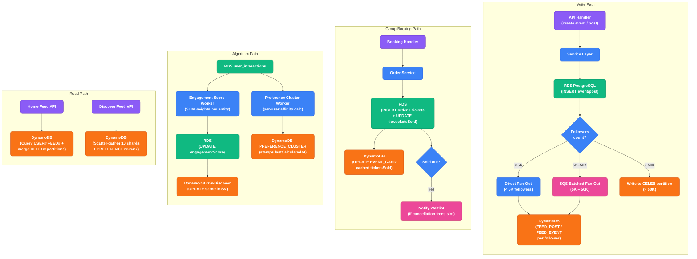
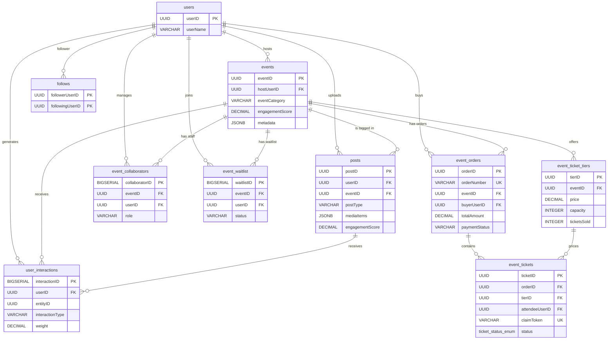

# HappniX Event & Social Database Design — Complete Strategy

## TL;DR — Use BOTH (RDS + DynamoDB)

You should follow **the exact same dual-database pattern** you already use for users:

| Layer | Database | Role |
|-------|----------|------|
| **Source of truth** | **RDS PostgreSQL** | All events, posts, tickets, transactions, and interactions — relational integrity, aggregations, complex queries |
| **Fast read projection** | **DynamoDB** | Polymorphic home feeds, global discovery, user preference clusters — sub-10ms reads at scale |

This is not redundant — it's the proven CQRS pattern. RDS holds the truth → DynamoDB holds the pre-computed feed caches.

---

## Part 1: RDS PostgreSQL Schema (Source of Truth)

### New Enums

```sql
-- Event lifecycle
CREATE TYPE event_status_enum AS ENUM ('Draft', 'Published', 'SoldOut', 'Cancelled', 'Completed', 'Suspended');
-- Ticket pricing model
CREATE TYPE ticket_type_enum AS ENUM ('Free', 'Paid', 'Donation', 'Invite');
-- Event visibility
CREATE TYPE event_visibility_enum AS ENUM ('Public', 'Private', 'Unlisted');
-- Ticket status
CREATE TYPE ticket_status_enum AS ENUM ('Confirmed', 'Pending', 'Cancelled', 'Refunded', 'CheckedIn', 'Expired');
```

### `events` — Core Event Table

```sql
CREATE TABLE IF NOT EXISTS events (
    "eventID"           UUID PRIMARY KEY,
    "hostUserID"        UUID NOT NULL REFERENCES users("userID") ON DELETE CASCADE,
    "eventUID"          VARCHAR(12) NOT NULL UNIQUE,

    "title"             VARCHAR(255) NOT NULL,
    "description"       TEXT,
    "eventCategory"     VARCHAR(50) NOT NULL,            -- Free-text, loaded from frontend categories.json
    "tags"              TEXT[],                          -- e.g., ['Techno', 'Outdoor']

    "startAt"           TIMESTAMPTZ NOT NULL,
    "endAt"             TIMESTAMPTZ,
    "startLabel"        VARCHAR(100),
    "timezone"          VARCHAR(50) NOT NULL DEFAULT 'Asia/Kolkata',

    "locationName"      VARCHAR(255),
    "locationAddress"   TEXT,
    "latitude"          DECIMAL(10, 7),
    "longitude"         DECIMAL(10, 7),
    "isOnline"          BOOLEAN NOT NULL DEFAULT FALSE,
    "onlineLink"        VARCHAR(500),

    "ticketType"        ticket_type_enum NOT NULL DEFAULT 'Free',
    "basePrice"         DECIMAL(10, 2) DEFAULT 0.00,
    "currency"          VARCHAR(3) NOT NULL DEFAULT 'INR',
    "maxAttendees"      INTEGER,                         -- Global event capacity

    "visibility"        event_visibility_enum NOT NULL DEFAULT 'Public',
    "status"            event_status_enum NOT NULL DEFAULT 'Draft',
    "coverImageUrl"     VARCHAR(500),

    "engagementScore"   DECIMAL(10, 2) NOT NULL DEFAULT 0.00, -- Computed by worker: weighted sum of views, likes, shares, ticket sales
    "metadata"          JSONB DEFAULT '{}'::jsonb,       -- DYNAMIC FIELDS (dresscode, etc.)
    "policies"          JSONB DEFAULT '{}'::jsonb,

    "createdAt"         TIMESTAMPTZ NOT NULL DEFAULT CURRENT_TIMESTAMP,
    "updatedAt"         TIMESTAMPTZ NOT NULL DEFAULT CURRENT_TIMESTAMP
);

CREATE INDEX IF NOT EXISTS events_host_idx ON events("hostUserID");
CREATE INDEX IF NOT EXISTS events_category_idx ON events("eventCategory");
CREATE INDEX IF NOT EXISTS events_start_at_idx ON events("startAt");
CREATE INDEX IF NOT EXISTS events_engagement_idx ON events("engagementScore" DESC);
```

> **Note on `ticketsSold`:** This value is NOT stored on the `events` table. It is a **derived value** computed at query time via `SELECT SUM("ticketsSold") FROM event_ticket_tiers WHERE "eventID" = ?`. This eliminates the risk of the counter drifting out of sync with the actual tier-level counts. The DynamoDB `EVENT_CARD` projection will store a cached `ticketsSold` number that gets updated by the sync worker.

### `follows` — Social Graph

The entire feed fan-out architecture depends on this table. Without it, the fan-out worker cannot determine who to write FEED items to.

```sql
CREATE TABLE IF NOT EXISTS follows (
    "followerUserID"    UUID NOT NULL REFERENCES users("userID") ON DELETE CASCADE,
    "followingUserID"   UUID NOT NULL REFERENCES users("userID") ON DELETE CASCADE,
    "createdAt"         TIMESTAMPTZ NOT NULL DEFAULT CURRENT_TIMESTAMP,
    PRIMARY KEY ("followerUserID", "followingUserID")
);

CREATE INDEX IF NOT EXISTS follows_following_idx ON follows("followingUserID");
```

> **How the fan-out worker uses this:** When User B creates a post, the worker runs `SELECT "followerUserID" FROM follows WHERE "followingUserID" = '<User B ID>'` to get all followers, then writes a FEED item to each follower's DynamoDB partition.

### `event_collaborators` — Co-Hosts & Scanners
```sql
CREATE TABLE IF NOT EXISTS event_collaborators (
    "collaboratorID"    BIGSERIAL PRIMARY KEY,
    "eventID"           UUID NOT NULL REFERENCES events("eventID") ON DELETE CASCADE,
    "userID"            UUID NOT NULL REFERENCES users("userID") ON DELETE CASCADE,
    "role"              VARCHAR(50) NOT NULL,  -- 'Co-Host', 'Scanner', 'Editor'
    "addedAt"           TIMESTAMPTZ NOT NULL DEFAULT CURRENT_TIMESTAMP,
    CONSTRAINT unique_collaborator UNIQUE ("eventID", "userID")
);
```

### `posts` — Social Media Posts & Reels

```sql
CREATE TABLE IF NOT EXISTS posts (
    "postID"        UUID PRIMARY KEY,
    "userID"        UUID NOT NULL REFERENCES users("userID") ON DELETE CASCADE,
    "eventID"       UUID REFERENCES events("eventID") ON DELETE SET NULL,

    "postType"      VARCHAR(20) NOT NULL DEFAULT 'Standard',  -- 'Standard' or 'Reel'
    "mediaItems"    JSONB NOT NULL,               -- e.g., [{"type": "image", "url": "..."}, {"type": "video", "url": "..."}]
    "caption"       TEXT,                         
    
    "likesCount"    INTEGER DEFAULT 0,
    "commentsCount" INTEGER DEFAULT 0,
    "engagementScore" DECIMAL(10, 2) NOT NULL DEFAULT 0.00, -- Computed by worker for GSI-Discover ranking

    "createdAt"     TIMESTAMPTZ NOT NULL DEFAULT CURRENT_TIMESTAMP,
    "updatedAt"     TIMESTAMPTZ NOT NULL DEFAULT CURRENT_TIMESTAMP
);
CREATE INDEX IF NOT EXISTS posts_user_idx ON posts("userID");
CREATE INDEX IF NOT EXISTS posts_event_idx ON posts("eventID");
CREATE INDEX IF NOT EXISTS posts_engagement_idx ON posts("engagementScore" DESC);
```

### `user_interactions` — The Recommendation Engine Brain

```sql
CREATE TABLE IF NOT EXISTS user_interactions (
    "interactionID"     BIGSERIAL PRIMARY KEY,
    "userID"            UUID NOT NULL REFERENCES users("userID") ON DELETE CASCADE,
    "entityID"          UUID NOT NULL,                   -- ID of the Post or Event
    "entityType"        VARCHAR(20) NOT NULL,            -- 'event', 'post'
    "interactionType"   VARCHAR(20) NOT NULL,            -- 'view', 'like', 'save', 'share', 'attend'
    "weight"            DECIMAL(5,2) NOT NULL DEFAULT 1.0, -- Like = 1.0, Share = 2.0, Attend = 5.0
    "createdAt"         TIMESTAMPTZ NOT NULL DEFAULT CURRENT_TIMESTAMP,
    CONSTRAINT unique_interaction UNIQUE ("userID", "entityID", "interactionType")
);
CREATE INDEX IF NOT EXISTS interactions_user_idx ON user_interactions("userID");
CREATE INDEX IF NOT EXISTS interactions_entity_idx ON user_interactions("entityID");
```

### `event_ticket_tiers` — Strict Inventory Pricing

```sql
CREATE TABLE IF NOT EXISTS event_ticket_tiers (
    "tierID"            UUID PRIMARY KEY,
    "eventID"           UUID NOT NULL REFERENCES events("eventID") ON DELETE CASCADE,
    "name"              VARCHAR(100) NOT NULL,           -- 'VIP', 'General Admission'
    "description"       TEXT,
    "price"             DECIMAL(10, 2) NOT NULL DEFAULT 0.00,
    "capacity"          INTEGER,                         -- NULL = unlimited for this specific tier
    "ticketsSold"       INTEGER NOT NULL DEFAULT 0,      -- Single source of truth for sold count
    "isActive"          BOOLEAN NOT NULL DEFAULT TRUE,
    "createdAt"         TIMESTAMPTZ NOT NULL DEFAULT CURRENT_TIMESTAMP,
    "updatedAt"         TIMESTAMPTZ NOT NULL DEFAULT CURRENT_TIMESTAMP
);
CREATE INDEX IF NOT EXISTS tiers_event_idx ON event_ticket_tiers("eventID");
```

### `event_orders` — The Group Booking / Cart System

To support Group Tickets, a user creates an **Order** (the cart) and pays once. The order generates multiple **Tickets**.

```sql
CREATE TABLE IF NOT EXISTS event_orders (
    "orderID"               UUID PRIMARY KEY,
    "orderNumber"           VARCHAR(16) NOT NULL UNIQUE,    -- Human-readable: 'HX-ORD-7K9M2'
    "eventID"               UUID NOT NULL REFERENCES events("eventID") ON DELETE RESTRICT, -- RESTRICT: never delete events that have orders
    "buyerUserID"           UUID NOT NULL REFERENCES users("userID"),
    
    "subtotal"              DECIMAL(10, 2) NOT NULL DEFAULT 0.00,
    "platformFee"           DECIMAL(10, 2) NOT NULL DEFAULT 0.00,
    "totalAmount"           DECIMAL(10, 2) NOT NULL DEFAULT 0.00,
    
    "paymentStatus"         VARCHAR(20) NOT NULL DEFAULT 'Pending', -- 'Pending', 'Paid', 'Failed', 'Refunded'
    "paymentTransactionID"  VARCHAR(255),                           -- Razorpay/Stripe generic ID
    "paymentMethod"         VARCHAR(50),
    
    "createdAt"             TIMESTAMPTZ NOT NULL DEFAULT CURRENT_TIMESTAMP,
    "updatedAt"             TIMESTAMPTZ NOT NULL DEFAULT CURRENT_TIMESTAMP,
    "completedAt"           TIMESTAMPTZ
);
CREATE INDEX IF NOT EXISTS orders_buyer_idx ON event_orders("buyerUserID");
CREATE INDEX IF NOT EXISTS orders_event_idx ON event_orders("eventID");
CREATE INDEX IF NOT EXISTS orders_number_idx ON event_orders("orderNumber");
```

> **Important — Soft Delete & Audit Trail:** The `event_orders` table uses `ON DELETE RESTRICT` (not CASCADE). This means an event **cannot** be deleted if it has any orders, even cancelled/refunded ones. Financial records must survive for compliance and dispute resolution. To "remove" an event, set its `status` to `'Cancelled'` instead of deleting the row.

### `event_tickets` — Individual Attendee Barcodes

```sql
CREATE TABLE IF NOT EXISTS event_tickets (
    "ticketID"              UUID PRIMARY KEY,
    "orderID"               UUID NOT NULL REFERENCES event_orders("orderID") ON DELETE RESTRICT,
    "eventID"               UUID NOT NULL REFERENCES events("eventID") ON DELETE RESTRICT,
    "tierID"                UUID NOT NULL REFERENCES event_ticket_tiers("tierID"),
    
    -- Attendee details (Can be the buyer or their friends)
    "attendeeUserID"        UUID REFERENCES users("userID"),  -- Nullable if friend doesn't have an account yet
    "attendeeName"          VARCHAR(255),                     -- Friend's name
    "attendeeEmail"         VARCHAR(255),                     -- Friend's email for claim flow
    
    -- Claim flow: when a ticket is bought for a non-platform friend
    "claimToken"            VARCHAR(255) UNIQUE,              -- Sent via email; friend uses this to link the ticket
    "claimedAt"             TIMESTAMPTZ,                      -- When the friend signed up and claimed the ticket
    
    "status"                ticket_status_enum NOT NULL DEFAULT 'Pending',
    "ticketQrPayload"       TEXT,
    "checkedInAt"           TIMESTAMPTZ,
    
    "createdAt"             TIMESTAMPTZ NOT NULL DEFAULT CURRENT_TIMESTAMP,
    "updatedAt"             TIMESTAMPTZ NOT NULL DEFAULT CURRENT_TIMESTAMP
);
CREATE INDEX IF NOT EXISTS tickets_order_idx ON event_tickets("orderID");
CREATE INDEX IF NOT EXISTS tickets_attendee_idx ON event_tickets("attendeeUserID");
CREATE INDEX IF NOT EXISTS tickets_claim_token_idx ON event_tickets("claimToken");
CREATE INDEX IF NOT EXISTS tickets_event_idx ON event_tickets("eventID");
```

#### Ticket Claim Flow (For Non-Platform Friends)

When a buyer books a ticket for a friend who is not on HappniX:

1. **At Booking:** The backend generates a unique `claimToken` (e.g., a signed JWT or UUID) and stores it on the ticket row alongside the friend's `attendeeName` and `attendeeEmail`.
2. **Notification:** An email is sent to `attendeeEmail` containing a deep-link: `https://happnix.com/claim?token=<claimToken>`.
3. **Friend Signs Up:** When the friend clicks the link and creates a HappniX account, the backend matches the `claimToken`, sets `attendeeUserID` to the new user's ID, sets `claimedAt` to `now()`, and nullifies the `claimToken`.
4. **Already a User:** If the email matches an existing user during booking, the backend skips the claim flow entirely and directly sets `attendeeUserID`.

### `event_waitlist` — Sold-Out Queue

```sql
CREATE TABLE IF NOT EXISTS event_waitlist (
    "waitlistID"        BIGSERIAL PRIMARY KEY,
    "eventID"           UUID NOT NULL REFERENCES events("eventID") ON DELETE CASCADE,
    "userID"            UUID NOT NULL REFERENCES users("userID") ON DELETE CASCADE,
    "tierID"            UUID REFERENCES event_ticket_tiers("tierID"), -- Optional specific tier
    "status"            VARCHAR(20) NOT NULL DEFAULT 'Waiting',       -- 'Waiting', 'Notified', 'Joined'
    "joinedAt"          TIMESTAMPTZ NOT NULL DEFAULT CURRENT_TIMESTAMP,
    CONSTRAINT unique_waitlist UNIQUE ("eventID", "userID")
);
```

---

## Part 2: DynamoDB Event Entities (Fast Read Layer)

| Attribute | Type | Description |
|-----------|------|-------------|
| **`PK`** | String | Partition Key |
| **`SK`** | String | Sort Key |

#### Entity 1: `EVENT_CARD` — For Discovery
> **PK**: `EVENT#<eventID>` | **SK**: `CARD`

Denormalized card with `title`, `coverImageUrl`, `startAt`, `eventCategory`, `tags`, a cached `ticketsSold` (synced from the SUM of tiers), and `engagementScore` (synced from RDS — used as the GSI-Discover sort value).

#### Entity 2 & 3: The Polymorphic Feed (`FEED_POST` & `FEED_EVENT`)
> **PK**: `USER#<followerUserID>` | **SK**: `FEED#<createdAt>#<itemID>`

When a user creates a Post or Event, it is fanned out to this partition for every follower. Both use the `FEED#<timestamp>` Sort Key, so DynamoDB automatically interleaves them chronologically. Contains `entityType` (`FEED_POST` or `FEED_EVENT`) so the frontend renders the correct React component.

##### Fan-Out Cost Control Strategy

Writing a copy to every follower's partition is cheap for normal users but dangerous for popular accounts. The strategy:

| Follower Count | Strategy | How It Works |
|----------------|----------|--------------|
| **< 5,000** | **Fan-out-on-write** | Standard path. When user posts, the worker queries the `follows` table, then writes a FEED item to all followers' DynamoDB partitions immediately. |
| **5,000 – 50,000** | **Batched fan-out** | The worker pushes an SQS message. A background Lambda drains the queue and writes in batches of 25 (DynamoDB `BatchWriteItem` limit) with exponential backoff. |
| **> 50,000** | **Fan-out-on-read (pull model)** | No fan-out write happens. Instead, the user's content is written to a `CELEB#<userID>` partition. When a follower opens their feed, the backend merges their personal `FEED#` items with the latest items from the `CELEB#` partitions of any celebrity-tier accounts they follow, all in-memory inside the Lambda. |

This prevents a single viral creator from triggering 100,000+ write operations in one burst.

#### Entity 4: `PREFERENCE_CLUSTER` — Machine Learning Profile
> **PK**: `USER#<userID>` | **SK**: `PREF#CLUSTER`

Calculated nightly or continuously based on `user_interactions`.

| Attribute | Type | Purpose |
|-----------|------|---------|
| `topCategories` | Map | `{"Nightlife": 0.8, "College": 0.2}` |
| `topTags` | Map | `{"Techno": 0.9, "Outdoor": 0.4}` |
| `lastCalculatedAt` | String (ISO 8601) | Staleness check — if older than 7 days, the serving Lambda falls back to the generic trending feed instead of using potentially outdated preferences |
| `interactionCount` | Number | Total interactions used for this calculation — helps determine confidence level |

#### Entity 5: `CELEB` — Celebrity Content Cache (Pull Model)
> **PK**: `CELEB#<userID>` | **SK**: `POST#<createdAt>#<itemID>`

Only used for users with >50,000 followers. Their content is stored here instead of being fanned out. Followers' feed Lambdas merge this partition at read time.

### GSIs (Global Secondary Indexes)

#### `GSI-Discover` — The Global Algorithm Feed (Sharded)

DynamoDB has a hard limit of **10 GB per partition** and throttles writes at ~1,000 WCU per partition key. If every discoverable item used `PK = 'DISCOVER'`, you'd hit a hot partition bottleneck as the platform grows.

**Solution: Shard the Discover feed across N partitions.**

| GSI Name | PK | SK | Purpose |
|----------|----|----|---------|
| `GSI-Discover` | `DISCOVER#SHARD_<0-9>` | `<engagement_score>#<timestamp>` | Sharded global algorithm feed |
| `GSI-Category` | `eventCategory` | `startAt` | Browse specifically by category |

**How the sharding works:**

1. **On Write:** When an event or post qualifies for discovery, the backend assigns it to a random shard: `DISCOVER#SHARD_` + `hash(itemID) % 10`. This spreads write traffic evenly across 10 DynamoDB partitions instead of hammering one.
2. **On Read:** When a user opens the Discover tab, the backend fires **10 parallel DynamoDB queries** (one per shard), each returning the top 10 items sorted by engagement score. The Lambda merges and re-sorts the 100 results in-memory, applies the user's `PREFERENCE_CLUSTER` re-ranking, and returns the top 20 to the frontend. Total latency: ~15ms (DynamoDB queries run in parallel).
3. **Scaling:** If 10 shards become insufficient (>100K discoverable items with frequent score updates), simply increase to 20 or 50 shards. The read pattern (scatter-gather) scales linearly.

---

## Part 3: The Recommendation Algorithm Flow

To show users what they actually *need* to see, we use the architecture defined above:

1. **Capture (RDS):** When a user views a Reel, likes a Post, or buys an Event Ticket, the frontend calls an interaction endpoint. This saves a row in the `user_interactions` RDS table with a specific `weight` (e.g., View = 0.5, Like = 1.0, Attend = 5.0).
2. **Score (Lambda Worker):** A periodic worker aggregates interactions per entity (`SUM(weight) GROUP BY entityID`) and writes the result into `events.engagementScore` or `posts.engagementScore` in RDS. This score is then synced to the DynamoDB `GSI-Discover` Sort Key.
3. **Cluster (Lambda Worker):** A separate worker reads a user's recent interactions, looks up the `tags` and `categories` attached to those events/posts, and calculates an affinity score. It stamps `lastCalculatedAt` on the result.
4. **Cache (DynamoDB):** The worker writes this calculated affinity into the user's `PREFERENCE_CLUSTER` in DynamoDB.
5. **Serve (DynamoDB GSI):** When the user opens the "Discover" tab, the backend:
   - Checks `PREFERENCE_CLUSTER.lastCalculatedAt`. If stale (> 7 days), falls back to generic trending.
   - Fires 10 parallel queries across `GSI-Discover` shards.
   - Merges results, applies preference re-ranking, returns top 20 in <20ms.

---

## Part 4: Data Flow — How RDS & DynamoDB Stay in Sync



### Sync Strategy

| Operation | RDS Action | DynamoDB Action |
|-----------|-----------|----------------|
| **Create Event** | INSERT into `events` + INSERT tiers | PUT `EVENT_CARD` + Fan-out `FEED_EVENT` to followers |
| **Create Post/Reel** | INSERT into `posts` | Fan-out `FEED_POST` to followers (or write to `CELEB#`) |
| **Group Booking** | INSERT `event_orders` + INSERT N `event_tickets` + UPDATE `event_ticket_tiers.ticketsSold` (row lock) | UPDATE `EVENT_CARD.ticketsSold` (cached) |
| **Cancel Ticket** | UPDATE `event_tickets.status` + UPDATE tier `ticketsSold` | UPDATE `EVENT_CARD.ticketsSold` + Check waitlist |
| **Cancel Event** | UPDATE `events.status = 'Cancelled'` (NOT delete — orders preserved) | UPDATE `EVENT_CARD.status` |
| **Claim Ticket** | UPDATE `event_tickets`: set `attendeeUserID`, null `claimToken`, set `claimedAt` | *(no DynamoDB action)* |
| **Score Update** | Worker: UPDATE `events.engagementScore` / `posts.engagementScore` | Worker: UPDATE GSI-Discover SK value |

---

## Part 5: Relationship Diagram (Phase 1)



---

## Part 6: Manifest.json Additions

```json
{
  "dynamodb": {
    "tables": {
      "events": {
        "env_var": "EVENTS_TABLE_NAME",
        "keys": {
          "pk": "PK",
          "sk": "SK"
        },
        "entities": {
          "EVENT_CARD": { "entityType": "EVENT_CARD" },
          "FEED_POST": { "entityType": "FEED_POST" },
          "FEED_EVENT": { "entityType": "FEED_EVENT" },
          "CELEB": { "entityType": "CELEB" },
          "PREFERENCE_CLUSTER": { "entityType": "PREFERENCE_CLUSTER" }
        },
        "gsis": {
          "GSI-Discover": {
            "pk": "discoverShard",
            "sk": "engagementSortKey",
            "shard_count": 10,
            "shard_prefix": "DISCOVER#SHARD_"
          },
          "GSI-Category": {
            "pk": "eventCategory",
            "sk": "startAt"
          }
        }
      }
    }
  },
  "rds": {
    "tables": {
      "events": {
        "pk": "eventID",
        "columns": [
          "eventID", "hostUserID", "eventUID", "title", "description",
          "eventCategory", "tags", "startAt", "endAt", "startLabel", "timezone",
          "locationName", "locationAddress", "latitude", "longitude",
          "isOnline", "onlineLink", "ticketType", "basePrice", "currency",
          "maxAttendees", "visibility", "status",
          "coverImageUrl", "engagementScore", "metadata", "policies",
          "createdAt", "updatedAt"
        ],
        "default_status": "Draft"
      },
      "follows": {
        "pk": ["followerUserID", "followingUserID"],
        "columns": ["followerUserID", "followingUserID", "createdAt"]
      },
      "posts": {
        "pk": "postID",
        "columns": [
          "postID", "userID", "eventID", "postType", "mediaItems",
          "caption", "likesCount", "commentsCount", "engagementScore",
          "createdAt", "updatedAt"
        ]
      },
      "user_interactions": {
        "pk": "interactionID",
        "columns": [
          "interactionID", "userID", "entityID", "entityType",
          "interactionType", "weight", "createdAt"
        ]
      },
      "event_ticket_tiers": {
        "pk": "tierID",
        "columns": [
          "tierID", "eventID", "name", "description", "price",
          "capacity", "ticketsSold", "isActive", "createdAt", "updatedAt"
        ]
      },
      "event_orders": {
        "pk": "orderID",
        "columns": [
          "orderID", "orderNumber", "eventID", "buyerUserID",
          "subtotal", "platformFee", "totalAmount",
          "paymentStatus", "paymentTransactionID", "paymentMethod",
          "createdAt", "updatedAt", "completedAt"
        ],
        "default_status": "Pending",
        "on_delete_event": "RESTRICT"
      },
      "event_tickets": {
        "pk": "ticketID",
        "columns": [
          "ticketID", "orderID", "eventID", "tierID", "attendeeUserID",
          "attendeeName", "attendeeEmail", "claimToken", "claimedAt",
          "status", "ticketQrPayload", "checkedInAt", "createdAt", "updatedAt"
        ],
        "default_status": "Pending",
        "on_delete_event": "RESTRICT"
      },
      "event_collaborators": {
        "pk": "collaboratorID",
        "columns": ["collaboratorID", "eventID", "userID", "role", "addedAt"]
      },
      "event_waitlist": {
        "pk": "waitlistID",
        "columns": ["waitlistID", "eventID", "userID", "tierID", "status", "joinedAt"]
      }
    }
  }
}
```
