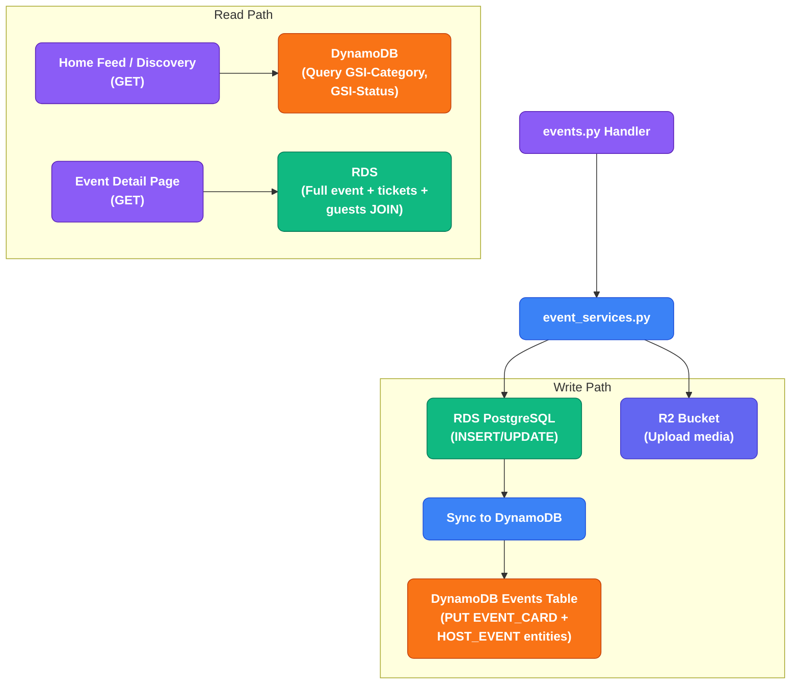
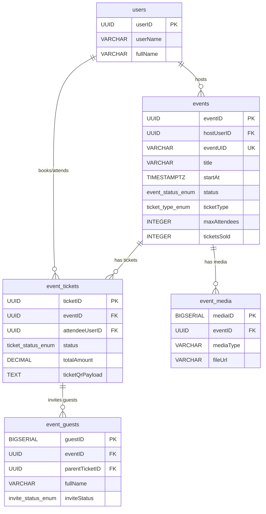

# HappniX Event Database Design — Complete Strategy

## TL;DR — Use BOTH (RDS + DynamoDB)

You should follow **the exact same dual-database pattern** you already use for users:

| Layer | Database | Role |
|-------|----------|------|
| **Source of truth** | **RDS PostgreSQL** | All event data, tickets, guests, payments — relational integrity, transactions, complex queries |
| **Fast read projection** | **DynamoDB** | Event feed cards, discovery, nearby events, geo-search — sub-10ms reads at scale |

This is not redundant — it's the same proven pattern you already have: RDS holds `users` (truth) → DynamoDB holds `PROFILE` + `SETTINGS` (fast reads). Events should follow the same flow.

---

## Why Not DynamoDB Only?

Events are **deeply relational**. A single event touches:

- The **host** (FK → `users.userID`)
- Multiple **tickets** (each FK → `users.userID` + `events.eventID`)
- Multiple **guests** per ticket (FK → `event_tickets`)
- **Payment transactions** with integrity constraints
- **Media assets** linked to the event
- **Capacity math** (max_attendees vs tickets_sold — must be atomic)

DynamoDB cannot enforce foreign keys, unique constraints across items, or multi-item transactions reliably for this level of complexity. Trying to force all of this into DynamoDB leads to:

- Data inconsistency (oversold events, orphaned tickets)
- Painful GSI explosion to support all query patterns
- No transactional guarantees for booking flows

## Why Not RDS Only?

RDS is great for writes and complex queries, but **slow for high-frequency reads** at scale:

- Home feed showing 50+ event cards → cold RDS query every time = slow
- "Nearby events" with geo-filtering → PostgreSQL can do it but DynamoDB + GSI is faster at scale
- Event discovery with category/date filters → DynamoDB single-table queries are sub-10ms

**The answer is both**: Write to RDS → Sync to DynamoDB for reads.

---

## Part 1: RDS PostgreSQL Schema (Source of Truth)

### New Enums

```sql
-- Event lifecycle
CREATE TYPE event_status_enum AS ENUM (
    'Draft',        -- Host is still editing, not visible
    'Published',    -- Live and discoverable
    'SoldOut',      -- Max attendees reached
    'Cancelled',    -- Host cancelled
    'Completed',    -- Event date has passed
    'Suspended'     -- Admin action
);

-- Ticket pricing model
CREATE TYPE ticket_type_enum AS ENUM (
    'Free',         -- No charge
    'Paid',         -- Fixed price or tiered
    'Donation',     -- Pay what you want
    'Invite'        -- By invitation only
);

-- Event visibility
CREATE TYPE event_visibility_enum AS ENUM (
    'Public',       -- Anyone can see and book
    'Private',      -- Only via invite link/code
    'Unlisted'      -- Not in search, but link works
);

-- Ticket status
CREATE TYPE ticket_status_enum AS ENUM (
    'Confirmed',
    'Pending',       -- Awaiting payment or approval
    'Cancelled',
    'Refunded',
    'CheckedIn',
    'Expired'
);

-- Guest invite status
CREATE TYPE invite_status_enum AS ENUM (
    'Pending',
    'Accepted',
    'Declined',
    'Expired'
);
```

---

### `events` — Core Event Table

```sql
CREATE TABLE IF NOT EXISTS events (
    -- Identity
    "eventID"           UUID PRIMARY KEY,               -- UUIDv7 (same generator as userID)
    "hostUserID"        UUID NOT NULL REFERENCES users("userID") ON DELETE CASCADE,
    "eventUID"          VARCHAR(12) NOT NULL UNIQUE,     -- Short shareable code (e.g., "HX-A7K9M2")

    -- Content
    "title"             VARCHAR(255) NOT NULL,
    "description"       TEXT,
    "eventCategory"     VARCHAR(50) NOT NULL,            -- 'Nightlife', 'College', 'Wedding', etc.
    "tags"              TEXT[],                           -- PostgreSQL array for flexible tagging

    -- Schedule
    "startAt"           TIMESTAMPTZ NOT NULL,
    "endAt"             TIMESTAMPTZ,
    "startLabel"        VARCHAR(100),                    -- Human-readable: "Doors open at 8 PM"
    "endLabel"          VARCHAR(100),                    -- "Afterparty till 2 AM"
    "timezone"          VARCHAR(50) NOT NULL DEFAULT 'Asia/Kolkata',

    -- Location
    "locationName"      VARCHAR(255),                    -- "Club XYZ, Mumbai"
    "locationAddress"   TEXT,                             -- Full address
    "latitude"          DECIMAL(10, 7),
    "longitude"         DECIMAL(10, 7),
    "isOnline"          BOOLEAN NOT NULL DEFAULT FALSE,
    "onlineLink"        VARCHAR(500),                    -- Zoom/Meet link for virtual events

    -- Ticketing
    "ticketType"        ticket_type_enum NOT NULL DEFAULT 'Free',
    "basePrice"         DECIMAL(10, 2) DEFAULT 0.00,
    "currency"          VARCHAR(3) NOT NULL DEFAULT 'INR',
    "ticketTiers"       JSONB,                           -- [{name: "VIP", price: 500, qty: 50}, ...]
    "maxAttendees"      INTEGER,                         -- NULL = unlimited
    "ticketsSold"       INTEGER NOT NULL DEFAULT 0,
    "serviceFeePercent" DECIMAL(5, 2) DEFAULT 0.00,      -- Platform fee %

    -- Visibility & Status
    "visibility"        event_visibility_enum NOT NULL DEFAULT 'Public',
    "status"            event_status_enum NOT NULL DEFAULT 'Draft',
    "isActive"          BOOLEAN NOT NULL DEFAULT TRUE,

    -- Media
    "coverImageUrl"     VARCHAR(500),                    -- Primary cover image (R2 URL)

    -- Settings
    "requireApproval"   BOOLEAN NOT NULL DEFAULT FALSE,  -- Host must approve each booking
    "allowGuestInvite"  BOOLEAN NOT NULL DEFAULT TRUE,   -- Ticket holders can invite guests
    "ageRestriction"    INTEGER,                         -- Minimum age (NULL = no restriction)

    -- Timestamps
    "createdAt"         TIMESTAMPTZ NOT NULL DEFAULT CURRENT_TIMESTAMP,
    "updatedAt"         TIMESTAMPTZ NOT NULL DEFAULT CURRENT_TIMESTAMP,
    "publishedAt"       TIMESTAMPTZ,                     -- When status changed to Published
    "cancelledAt"       TIMESTAMPTZ
);

-- Indexes
CREATE INDEX IF NOT EXISTS events_host_idx ON events("hostUserID");
CREATE INDEX IF NOT EXISTS events_status_idx ON events("status");
CREATE INDEX IF NOT EXISTS events_category_idx ON events("eventCategory");
CREATE INDEX IF NOT EXISTS events_start_at_idx ON events("startAt");
CREATE INDEX IF NOT EXISTS events_location_idx ON events("latitude", "longitude");
CREATE INDEX IF NOT EXISTS events_uid_idx ON events("eventUID");
CREATE INDEX IF NOT EXISTS events_visibility_idx ON events("visibility", "status", "startAt");
```

---

### `event_media` — Event Photos/Videos

```sql
CREATE TABLE IF NOT EXISTS event_media (
    "mediaID"       BIGSERIAL PRIMARY KEY,
    "eventID"       UUID NOT NULL REFERENCES events("eventID") ON DELETE CASCADE,
    "mediaType"     VARCHAR(20) NOT NULL,                -- 'image', 'video', 'flyer'
    "fileUrl"       VARCHAR(500) NOT NULL,                -- R2 URL
    "thumbnailUrl"  VARCHAR(500),                         -- For video thumbnails
    "sortOrder"     INTEGER NOT NULL DEFAULT 0,
    "caption"       VARCHAR(255),
    "createdAt"     TIMESTAMPTZ NOT NULL DEFAULT CURRENT_TIMESTAMP
);

CREATE INDEX IF NOT EXISTS event_media_event_idx ON event_media("eventID");
```

---

### `event_tickets` — Bookings

```sql
CREATE TABLE IF NOT EXISTS event_tickets (
    "ticketID"              UUID PRIMARY KEY,             -- UUIDv7
    "eventID"               UUID NOT NULL REFERENCES events("eventID") ON DELETE CASCADE,
    "attendeeUserID"        UUID NOT NULL REFERENCES users("userID") ON DELETE CASCADE,
    "bookedByUserID"        UUID NOT NULL REFERENCES users("userID"),  -- Could be different from attendee
    "paidByUserID"          UUID REFERENCES users("userID"),

    -- Ticket Details
    "tierName"              VARCHAR(100),                  -- 'General', 'VIP', 'Early Bird'
    "quantity"              INTEGER NOT NULL DEFAULT 1,
    "ticketPrice"           DECIMAL(10, 2) NOT NULL DEFAULT 0.00,
    "serviceFee"            DECIMAL(10, 2) NOT NULL DEFAULT 0.00,
    "totalAmount"           DECIMAL(10, 2) NOT NULL DEFAULT 0.00,

    -- Status
    "status"                ticket_status_enum NOT NULL DEFAULT 'Pending',
    "pendingReason"         VARCHAR(255),                  -- 'AwaitingPayment', 'AwaitingApproval'

    -- Payment
    "paymentTransactionID"  VARCHAR(255),
    "refundTransactionID"   VARCHAR(255),
    "paymentMethod"         VARCHAR(50),                   -- 'UPI', 'Card', 'Wallet'

    -- QR & Check-in
    "ticketQrPayload"       TEXT,                          -- Signed payload for QR verification
    "checkedInAt"           TIMESTAMPTZ,
    "checkedInByUserID"     UUID REFERENCES users("userID"),

    -- Group Booking
    "groupCode"             VARCHAR(20),                   -- Links group bookings together

    -- Timestamps
    "bookedAt"              TIMESTAMPTZ NOT NULL DEFAULT CURRENT_TIMESTAMP,
    "confirmedAt"           TIMESTAMPTZ,
    "cancelledAt"           TIMESTAMPTZ,
    "updatedAt"             TIMESTAMPTZ NOT NULL DEFAULT CURRENT_TIMESTAMP,

    -- Constraints
    CONSTRAINT unique_attendee_per_event UNIQUE ("attendeeUserID", "eventID")
);

CREATE INDEX IF NOT EXISTS tickets_event_idx ON event_tickets("eventID");
CREATE INDEX IF NOT EXISTS tickets_attendee_idx ON event_tickets("attendeeUserID");
CREATE INDEX IF NOT EXISTS tickets_status_idx ON event_tickets("status");
CREATE INDEX IF NOT EXISTS tickets_group_code_idx ON event_tickets("groupCode");
```

---

### `event_guests` — Non-Platform Guests (Invited by Ticket Holders)

```sql
CREATE TABLE IF NOT EXISTS event_guests (
    "guestID"               BIGSERIAL PRIMARY KEY,
    "eventID"               UUID NOT NULL REFERENCES events("eventID") ON DELETE CASCADE,
    "parentTicketID"        UUID NOT NULL REFERENCES event_tickets("ticketID") ON DELETE CASCADE,
    "invitedByUserID"       UUID NOT NULL REFERENCES users("userID"),

    -- Guest Info (may not have a HappniX account)
    "fullName"              VARCHAR(255) NOT NULL,
    "mobileNumber"          VARCHAR(20),
    "email"                 VARCHAR(255),
    "age"                   INTEGER,

    -- Verification
    "mobileOtpVerified"     BOOLEAN NOT NULL DEFAULT FALSE,
    "identityToken"         VARCHAR(255),                  -- Aadhaar token if applicable

    -- Status
    "inviteStatus"          invite_status_enum NOT NULL DEFAULT 'Pending',
    "inviteToken"           VARCHAR(255) UNIQUE,           -- For invite link
    "onboardingCompleted"   BOOLEAN NOT NULL DEFAULT FALSE,

    -- Payment
    "paidByTicketHolder"    BOOLEAN NOT NULL DEFAULT FALSE,
    "paymentReference"      VARCHAR(255),
    "paymentStatus"         VARCHAR(20) DEFAULT 'unpaid',

    -- QR
    "ticketQrPayload"       TEXT,

    -- Delivery
    "emailDeliveryStatus"   VARCHAR(20),
    "whatsappDeliveryStatus" VARCHAR(20),
    "emailSentAt"           TIMESTAMPTZ,
    "whatsappSentAt"        TIMESTAMPTZ,

    -- Timestamps
    "createdAt"             TIMESTAMPTZ NOT NULL DEFAULT CURRENT_TIMESTAMP,
    "cancelledAt"           TIMESTAMPTZ
);

CREATE INDEX IF NOT EXISTS guests_event_idx ON event_guests("eventID");
CREATE INDEX IF NOT EXISTS guests_ticket_idx ON event_guests("parentTicketID");
CREATE INDEX IF NOT EXISTS guests_invite_token_idx ON event_guests("inviteToken");
```

---

## Part 2: DynamoDB Event Entities (Fast Read Layer)

Following your existing single-table pattern on the **Users table** (`userID` + `userEntity`), events should get their **own dedicated DynamoDB table** since the access patterns are fundamentally different.

### New Table: `HappniX-Events-{env}`

| Attribute | Type | Description |
|-----------|------|-------------|
| **`PK`** | String | Partition Key — varies by entity type (see below) |
| **`SK`** | String | Sort Key — varies by entity type (see below) |

### Entity Design

#### Entity 1: `EVENT_CARD` — For Feed & Discovery

> **PK**: `EVENT#<eventID>` | **SK**: `CARD`

This is the denormalized "card" that the home feed, search, and discovery pages read. Written when an event is created/updated in RDS.

| Attribute | Type | Purpose |
|-----------|------|---------|
| `eventID` | String | UUIDv7 |
| `eventUID` | String | Short shareable code |
| `hostUserID` | String | Host's userID |
| `hostUsername` | String | Denormalized for display |
| `hostAvatar` | String | Denormalized for display |
| `title` | String | Event title |
| `description` | String | Truncated (first 200 chars) |
| `eventCategory` | String | Category |
| `tags` | List | Tags |
| `startAt` | String | ISO 8601 |
| `endAt` | String | ISO 8601 |
| `locationName` | String | Venue name |
| `latitude` | Number | Geo coordinate |
| `longitude` | Number | Geo coordinate |
| `isOnline` | Boolean | Virtual event flag |
| `ticketType` | String | Free/Paid/Donation/Invite |
| `basePrice` | Number | Starting price |
| `currency` | String | INR |
| `maxAttendees` | Number | Capacity |
| `ticketsSold` | Number | Current count |
| `spotsLeft` | Number | Computed: max - sold |
| `status` | String | Published/SoldOut/etc |
| `visibility` | String | Public/Private/Unlisted |
| `coverImageUrl` | String | Primary image |
| `createdAt` | String | ISO 8601 |
| `updatedAt` | String | ISO 8601 |

#### Entity 2: `HOST_EVENT` — Events by Host (for "My Events" page)

> **PK**: `HOST#<hostUserID>` | **SK**: `EVENT#<startAt>#<eventID>`

Allows querying all events by a specific host, sorted by date. Lightweight — just enough to render a list.

| Attribute | Type |
|-----------|------|
| `eventID` | String |
| `title` | String |
| `startAt` | String |
| `status` | String |
| `coverImageUrl` | String |
| `ticketsSold` | Number |

#### Entity 3: `ATTENDEE_TICKET` — User's Tickets (for "My Tickets" page)

> **PK**: `USER#<attendeeUserID>` | **SK**: `TICKET#<startAt>#<eventID>`

| Attribute | Type |
|-----------|------|
| `ticketID` | String |
| `eventID` | String |
| `title` | String |
| `startAt` | String |
| `locationName` | String |
| `ticketStatus` | String |
| `tierName` | String |
| `coverImageUrl` | String |

### GSIs (Global Secondary Indexes)

| GSI Name | PK | SK | Purpose |
|----------|----|----|---------|
| `GSI-Category` | `eventCategory` | `startAt` | Browse by category |
| `GSI-Status` | `status` | `startAt` | "Live now", "Upcoming" queries |
| `GSI-EventUID` | `eventUID` | — | Lookup by share code |

---

## Part 3: Manifest.json Additions

```json
{
  "dynamodb": {
    "tables": {
      "events": {
        "env_var": "EVENTS_TABLE_NAME",
        "keys": {
          "pk": "PK",
          "sk": "SK"
        },
        "entities": {
          "EVENT_CARD": {
            "entityType": "EVENT_CARD"
          },
          "HOST_EVENT": {
            "entityType": "HOST_EVENT"
          },
          "ATTENDEE_TICKET": {
            "entityType": "ATTENDEE_TICKET"
          }
        }
      }
    }
  },
  "rds": {
    "tables": {
      "events": {
        "pk": "eventID",
        "columns": [
          "eventID", "hostUserID", "eventUID", "title", "description",
          "eventCategory", "tags", "startAt", "endAt", "startLabel", "endLabel",
          "timezone", "locationName", "locationAddress", "latitude", "longitude",
          "isOnline", "onlineLink", "ticketType", "basePrice", "currency",
          "ticketTiers", "maxAttendees", "ticketsSold", "serviceFeePercent",
          "visibility", "status", "isActive", "coverImageUrl",
          "requireApproval", "allowGuestInvite", "ageRestriction",
          "publishedAt", "cancelledAt"
        ],
        "default_status": "Draft"
      },
      "event_media": {
        "pk": "mediaID",
        "columns": [
          "mediaID", "eventID", "mediaType", "fileUrl", "thumbnailUrl",
          "sortOrder", "caption"
        ]
      },
      "event_tickets": {
        "pk": "ticketID",
        "columns": [
          "eventID", "ticketID", "attendeeUserID", "bookedByUserID",
          "paidByUserID", "tierName", "quantity", "ticketPrice",
          "serviceFee", "totalAmount", "status", "pendingReason",
          "paymentTransactionID", "refundTransactionID", "paymentMethod",
          "ticketQrPayload", "checkedInAt", "checkedInByUserID", "groupCode",
          "bookedAt", "confirmedAt", "cancelledAt"
        ],
        "default_status": "Pending"
      },
      "event_guests": {
        "pk": "guestID",
        "columns": [
          "guestID", "eventID", "parentTicketID", "invitedByUserID",
          "fullName", "mobileNumber", "email", "age",
          "mobileOtpVerified", "identityToken", "inviteStatus", "inviteToken",
          "onboardingCompleted", "paidByTicketHolder", "paymentReference",
          "paymentStatus", "ticketQrPayload"
        ]
      }
    }
  }
}
```

---

## Part 4: Data Flow — How RDS & DynamoDB Stay in Sync



### Sync Strategy

| Operation | RDS Action | DynamoDB Action |
|-----------|-----------|----------------|
| **Create Event** | INSERT into `events` | PUT `EVENT_CARD` + PUT `HOST_EVENT` |
| **Update Event** | UPDATE `events` | PUT `EVENT_CARD` (overwrite) + PUT `HOST_EVENT` |
| **Cancel Event** | UPDATE `events.status = 'Cancelled'` | UPDATE `EVENT_CARD.status` + UPDATE `HOST_EVENT.status` |
| **Book Ticket** | INSERT `event_tickets` + UPDATE `events.ticketsSold` | UPDATE `EVENT_CARD.ticketsSold/spotsLeft` + PUT `ATTENDEE_TICKET` |
| **Cancel Ticket** | UPDATE `event_tickets.status` + UPDATE `events.ticketsSold` | UPDATE `EVENT_CARD.ticketsSold/spotsLeft` + DELETE `ATTENDEE_TICKET` |
| **Check-in** | UPDATE `event_tickets.checkedInAt` | *(no DynamoDB action needed — this is operational)* |

---

## Part 5: Access Patterns Summary

| Use Case | Who Queries | Database | Query |
|----------|-------------|----------|-------|
| Home feed — upcoming events | Any user | **DynamoDB** | GSI-Status: `status = Published`, SK > `now()` |
| Browse by category | Any user | **DynamoDB** | GSI-Category: `eventCategory = 'Nightlife'`, SK > `now()` |
| Event detail page | Any user | **RDS** | `SELECT * FROM events WHERE eventID = ?` + JOINs |
| My hosted events | Host | **DynamoDB** | PK = `HOST#<userID>`, SK begins_with `EVENT#` |
| My tickets | Attendee | **DynamoDB** | PK = `USER#<userID>`, SK begins_with `TICKET#` |
| Book a ticket | Attendee | **RDS** | Transactional INSERT (ticket) + UPDATE (ticketsSold) |
| Search by share code | Any user | **DynamoDB** | GSI-EventUID: `eventUID = 'HX-A7K9M2'` |
| Host dashboard — attendee list | Host | **RDS** | `SELECT * FROM event_tickets WHERE eventID = ? JOIN users` |
| QR check-in verification | Host/Staff | **RDS** | `SELECT * FROM event_tickets WHERE ticketQrPayload = ?` |
| Guest management | Ticket holder | **RDS** | `SELECT * FROM event_guests WHERE parentTicketID = ?` |
| Cancel event | Host | **RDS → DynamoDB** | Update both stores |
| Admin: suspended events | Admin | **RDS** | `SELECT * FROM events WHERE status = 'Suspended'` |

---

## Part 6: Relationship Diagram



---

## Open Questions for You

> [!IMPORTANT]
> ### 1. Event Categories — Fixed Enum or Free-Text?
> Should `eventCategory` be a PostgreSQL ENUM (like `'Nightlife'`, `'College'`, `'Wedding'`, `'Corporate'`, `'Private'`), or a free-text VARCHAR so hosts can type anything? Enum is safer but less flexible.

> [!IMPORTANT]
> ### 2. Ticket Tiers — How Complex?
> I used JSONB for `ticketTiers` (e.g., `[{name: "VIP", price: 500, qty: 50}]`). Should each tier be its own row in a separate `event_ticket_tiers` table instead? Separate table = stricter validation but more complexity.

> [!IMPORTANT]
> ### 3. Payment Integration — What Provider?
> The ticket booking flow needs a payment gateway (Razorpay, Stripe, etc.). Which provider are you planning to use? This affects `paymentTransactionID` format and the refund flow.

> [!IMPORTANT]
> ### 4. Recurring Events?
> Should we support recurring events (e.g., "Every Saturday at Club XYZ")? This would require a `recurrence_rule` column or a parent-child event pattern. Not included currently.

> [!IMPORTANT]
> ### 5. Waitlist?
> Your [recommendations.md](file:///e:/project/HappniX_dev/docs/project-handbook/recommendations.md) mentions waitlist as a future feature. Should we add a `waitlist_position` column or a separate `event_waitlist` table now, or defer it?

> [!IMPORTANT]
> ### 6. Co-Hosts / Event Staff?
> Should there be an `event_collaborators` table for co-hosts or door staff? Currently only one `hostUserID` is supported per event.
