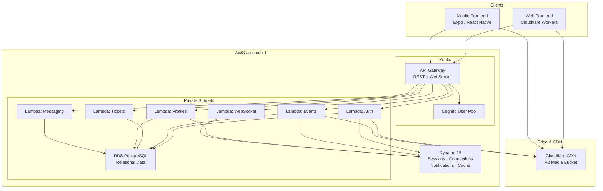
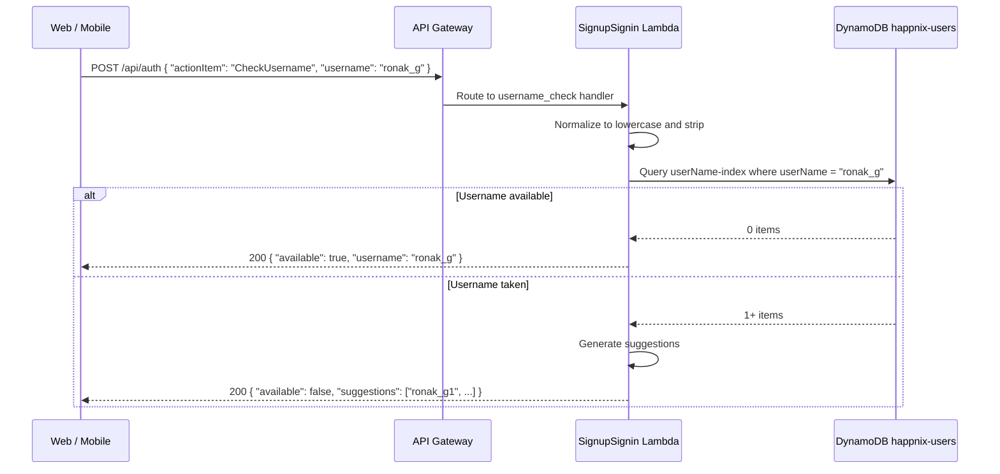
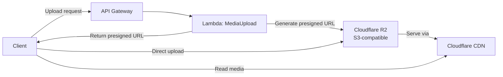
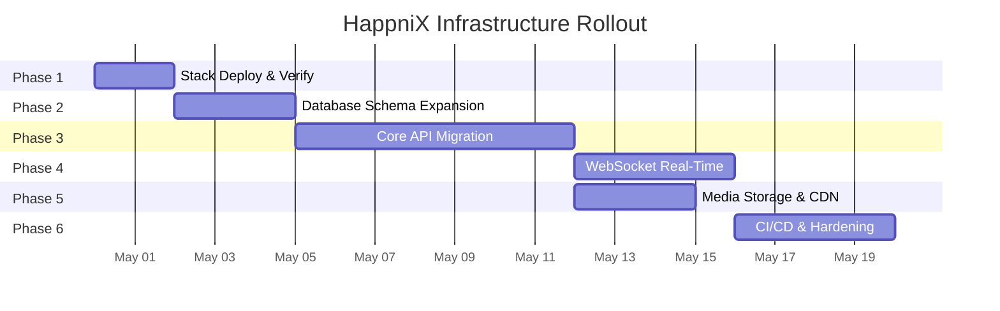

# HappniX-dev Infrastructure Implementation Plan

> **Project**: HappniX — Social Event Booking & Guest Management Platform  
> **Web Frontend**: Cloudflare Workers — `https://happnix-dev.ronakgo1.workers.dev/`  
> **Mobile Frontend**: Expo/React Native (deployment pending)  
> **Backend Target**: AWS Serverless (Lambda + API Gateway + RDS PostgreSQL + DynamoDB)  
> **Region**: `ap-south-1`  
> **Date**: 2026-04-29

---

## Current State Summary

| Layer | Status | Technology |
|-------|--------|------------|
| Web Frontend | ✅ Deployed | Cloudflare Workers (static HTML/JS/CSS) |
| Mobile Frontend | 🟡 Built, not deployed | Expo/React Native |
| Infra — Network Stack | ✅ Template ready | CloudFormation (VPC, subnets, NAT, SGs) |
| Infra — Data Stack | ✅ Template ready | CloudFormation (RDS PostgreSQL `db.t4g.micro` + DynamoDB tables) |
| Infra — App Stack | ✅ Template ready | CloudFormation (Cognito, API Gateway, Lambdas) |
| Backend — Auth | ✅ Working | `SignupSignin` Lambda + DynamoDB sessions (JWT-based) |
| Backend — Profile | ✅ Working | `ProfileApi` Lambda (self-healing DynamoDB + R2 + account deletion) |
| Backend — Home Page | 🟡 Partial | `HomePageApi` Lambda (feed + logout implemented, rest are stubs) |
| Backend — Core APIs | ❌ Not migrated | Events, Tickets, Guests, Messaging — all returning 501 stubs |
| CI/CD | 🟡 Partial | GitHub Actions for 3 stack deploys, no frontend CI |
| Media Storage | 🟡 Config exists | R2 params in template, no upload Lambda |
| Real-time / WebSocket | ❌ Not migrated | Was Django Channels, needs API Gateway WebSocket |

---

## Architecture Overview



### Dual-Database Strategy

| Store | Owns | Why |
|-------|------|-----|
| **RDS PostgreSQL** | Users, profiles, events, tickets, guests, follows, conversations, messages, group chat | Relational integrity, JOINs, transactions, complex queries |
| **DynamoDB** | Sessions, OTP state, WebSocket connections, notifications, event discovery cache, user presence | Sub-millisecond key-value lookups, auto-scaling, no VPC required, TTL for expiry |

---

## Infrastructure-Only Checklist (What to Provision — No Lambda Code)

> [!IMPORTANT]
> This section lists **only the AWS infrastructure resources** that need to exist for your Lambda code to work. You write the code; these are the "pipes and tables" your code plugs into.

> [!TIP]
> **Free Tier Monthly Cost: ~$0** with current defaults. All templates now use conditional parameters — NAT Gateway off (saves ~$32/mo), Cognito LITE (10K MAU free), RDS db.t4g.micro (12-month free), Lambda 128MB, DynamoDB on-demand (25 WCU/RCU always free). Flip `EnableNatGateway=true` only when you need external API calls.

| Resource | Free Tier Config | Toggle Parameter |
|----------|-----------------|------------------|
| RDS PostgreSQL | `db.t4g.micro`, 20GB gp2, single-AZ | `EnableRds` (default: true) |
| NAT Gateway | Off by default (saves ~$32/month) | `EnableNatGateway` (default: false) |
| VPC Endpoints | DynamoDB + S3 Gateway endpoints (free) | Always on |
| Cognito | LITE tier (10K MAU free) | Always on |
| Lambda | 128MB, 10s timeout | Always on |
| API Gateway | REST, REGIONAL | Always on |
| DynamoDB | PAY_PER_REQUEST (25 WCU/RCU free) | Per-table toggles |
| SES/SNS | Not used in dev (test OTP: 123456) | N/A |

### A. CloudFormation Template Updates

| Stack | Resource to Add | Type | Why |
|-------|----------------|------|-----|
| **data** | `HappniX-users-{env}` | DynamoDB Table | ✅ Done — username lookups via GSI |
| **data** | `HappniX-sessions-{env}` | DynamoDB Table | 🔲 Replace `dev_store.py` JSON sessions |
| **data** | `HappniX-otp-{env}` | DynamoDB Table | 🔲 OTP codes with 5-min TTL |
| **data** | `HappniX-connections-{env}` | DynamoDB Table | 🔲 WebSocket connection registry |
| **data** | `HappniX-presence-{env}` | DynamoDB Table | 🔲 Online/offline heartbeat |
| **data** | `HappniX-notifications-{env}` | DynamoDB Table | 🔲 Activity notifications |
| **app** | `EventsApi` Lambda definition | SAM Function | 🔲 You write the handler, SAM wires the API route |
| **app** | `TicketsApi` Lambda definition | SAM Function | 🔲 Same |
| **app** | `GuestsApi` Lambda definition | SAM Function | 🔲 Same |
| **app** | `ProfilesApi` Lambda definition | SAM Function | 🔲 Same |
| **app** | `MessagingApi` Lambda definition | SAM Function | 🔲 Same |
| **app** | `GroupChatApi` Lambda definition | SAM Function | 🔲 Same |
| **app** | `NotificationsApi` Lambda definition | SAM Function | 🔲 Same |
| **app** | `MediaApi` Lambda definition | SAM Function | 🔲 Presigned URL generation for R2 |
| **app** | `HappnixWebSocketApi` | API Gateway V2 | 🔲 WebSocket endpoint |
| **app** | `WsConnect/Disconnect/Message` | SAM Functions | 🔲 WebSocket handlers |

### B. API Gateway Routes to Wire

These routes must be defined in the app template — your Lambda code handles the logic, but the route **must exist** in CloudFormation:

```
# Events (5 routes)
POST   /api/events/create
GET    /api/events/{id}
DELETE /api/events/{id}
GET    /api/events/mine
GET    /api/events/nearby
GET    /api/events/live

# Tickets (8 routes)
GET    /api/tickets
POST   /api/tickets/book
POST   /api/tickets/{id}/pay
POST   /api/tickets/{id}/cancel
POST   /api/tickets/{id}/archive
DELETE /api/tickets/{id}/delete
POST   /api/tickets/{id}/group
POST   /api/tickets/{id}/verify         ← NEW (missing in original)

# Guest Invites (8 routes)
POST   /api/guest-invites
POST   /api/guest-invites/{token}/send-mobile-otp
POST   /api/guest-invites/{token}/verify-mobile-otp
POST   /api/guest-invites/{token}/onboarding
POST   /api/guest-invites/{token}/pay
POST   /api/guest-invites/{token}/pay-by-owner
POST   /api/guest-invites/{token}/cancel
POST   /api/guest-invites/{token}/cancel-by-owner

# Profiles & Social (12 routes)
GET    /api/users/search
POST   /api/users/follow
GET    /api/users/{id}/profile
GET    /api/profile/me
POST   /api/profile/update
POST   /api/profile/privacy
GET    /api/profile/follow-requests
GET    /api/profile/{graph_type}
GET    /api/settings/preferences
POST   /api/settings/preferences
GET    /api/settings/people/{category}
POST   /api/auth (actionItem: CheckUsername)   ← NEW (Instagram-style)

# Notifications (3 routes)
GET    /api/notifications
POST   /api/notifications/activity
POST   /api/notifications/read

# Messaging (10 routes)
GET    /api/messages/conversations
POST   /api/messages/conversations/start
GET    /api/messages/conversations/{id}/messages
POST   /api/messages/conversations/{id}/read
POST   /api/messages/messages/{id}/edit
POST   /api/messages/messages/{id}/forward
POST   /api/messages/messages/{id}/delete
POST   /api/messages/messages/{id}/unsend
POST   /api/messages/conversations/{id}/clear
DELETE /api/messages/conversations/{id}/delete

# Group Chat (10 routes)
POST   /api/messages/groups/create
GET    /api/messages/groups/{id}
GET    /api/messages/groups/{id}/messages
POST   /api/messages/groups/{id}/members
POST   /api/messages/groups/{id}/members/{uid}/role
POST   /api/messages/groups/{id}/members/{uid}/remove
POST   /api/messages/groups/{id}/rename
POST   /api/messages/groups/{id}/leave
POST   /api/messages/groups/{id}/clear
DELETE /api/messages/groups/{id}/delete
POST   /api/messages/group-messages/{id}/edit
POST   /api/messages/group-messages/{id}/delete
POST   /api/messages/group-messages/{id}/unsend

# Media (2 routes)
POST   /api/media/upload-url
POST   /api/media/delete
```

**Total: ~60 API routes + 3 WebSocket routes**

### C. IAM Policies (Lambda Permissions)

Add these to the `Globals` section of `infra/app/template.yaml`:

```yaml
Globals:
  Function:
    Policies:
      # Existing
      - VPCAccessPolicy: {}
      # New — DynamoDB access
      - DynamoDBCrudPolicy:
          TableName: !Sub HappniX-users-${EnvironmentName}
      - DynamoDBCrudPolicy:
          TableName: !Sub HappniX-sessions-${EnvironmentName}
      - DynamoDBCrudPolicy:
          TableName: !Sub HappniX-otp-${EnvironmentName}
      - DynamoDBCrudPolicy:
          TableName: !Sub HappniX-connections-${EnvironmentName}
      - DynamoDBCrudPolicy:
          TableName: !Sub HappniX-presence-${EnvironmentName}
      - DynamoDBCrudPolicy:
          TableName: !Sub HappniX-notifications-${EnvironmentName}
      # New — R2 media (S3-compatible)
      - Statement:
          Effect: Allow
          Action: [s3:PutObject, s3:GetObject, s3:DeleteObject]
          Resource: !Sub arn:aws:s3:::${R2BucketName}/*
      # New — WebSocket management
      - Statement:
          Effect: Allow
          Action: execute-api:ManageConnections
          Resource: !Sub arn:aws:execute-api:${AWS::Region}:${AWS::AccountId}:*/@connections/*
```

### D. Secrets Manager

| Secret | Current State | Target |
|--------|--------------|--------|
| DB password | Plain `AUTH_DB_PASSWORD` parameter | 🔲 Move to `aws secretsmanager` |
| KYC API token | Hardcoded in original code | 🔲 Store in Secrets Manager |
| R2 access keys | GitHub secrets only | 🔲 Store in Secrets Manager, reference in template |

### E. SES / SNS (Production Only — NOT for Dev)

> [!NOTE]
> **Dev environment bypasses OTP entirely** — `TestOtpMode=true` and `AllowFixedTestOtp=true` are defaults. The global test OTP `123456` works for all numbers. SES/SNS will only be configured when moving to production.

| Service | Use Case | When to Enable |
|---------|----------|---------------|
| **SES** | Email OTPs, guest invite emails, ticket confirmations | Production only |
| **SNS** | SMS OTPs to mobile numbers | Production only |
| **Alternative** | Twilio for SMS if SNS SMS is too limited | Production evaluation |

### F. Summary — What You Build vs What Infra Provides

| You Write (Lambda Code) | Infra Provides (CloudFormation) | Toggle |
|--------------------------|-------------------------------|--------|
| `events_api.lambda_handler` | API Gateway route + Lambda def + IAM | `EnableEventsApi` |
| `boto3.resource('dynamodb').Table(...)` | DynamoDB table with GSI | `EnableUsersTable` etc. |
| `boto3.client('s3').generate_presigned_url(...)` | R2 bucket + IAM policy | `EnableMediaApi` |
| WebSocket handler logic | API Gateway V2 WebSocket | Future phase |
| DB connection with `psycopg2` | RDS in private subnet + SG | `EnableRds` |

---

## Phase 1 — Foundation & AWS Application Bootstrap
**Duration**: 1–2 days  
**Goal**: Deploy all three CloudFormation stacks and verify end-to-end connectivity from the Cloudflare-hosted frontend through API Gateway to the auth Lambda and PostgreSQL.

### 1.1 Prerequisites

- [ ] AWS account with IAM role for GitHub OIDC (`AWS_ROLE_ARN` secret)
- [ ] AWS SAM CLI installed locally for dev testing
- [ ] GitHub configured:

**Secrets** (hidden — credentials only):

| Secret | Purpose |
|--------|---------|
| `AWS_ROLE_ARN` | OIDC deploy role ARN |
| `AUTH_DB_PASSWORD` | PostgreSQL master password |

**Environment Variables** (visible — safe to see):

| Variable | Example Value | Purpose |
|----------|--------------|---------|
| `AUTH_DB_NAME` | `happnixdb` | PostgreSQL database name |
| `AUTH_DB_USER` | `happnixadmin` | PostgreSQL master username |
| `R2_BUCKET_NAME` | `happnix-media-dev` | Cloudflare R2 bucket name |
| `R2_ENDPOINT` | `https://xxx.r2.cloudflarestorage.com` | R2 S3-compatible endpoint |
| `AWS_REGION` | `ap-south-1` | Deployment region |
| `ENVIRONMENT_NAME` | `dev` | Stack environment suffix |

### 1.2 Deploy Stacks

```
1. Deploy  happnix-network-dev  → VPC, subnets, NAT, security groups
2. Deploy  happnix-data-dev     → RDS PostgreSQL + DynamoDB tables (captures network outputs)
3. Deploy  happnix-app-dev      → Cognito, API Gateway, Auth Lambda, Schema Init
```

- The `AuthSchemaInit` custom resource automatically runs [happnix_auth_schema.sql](file:///e:/project/HappniX_dev/backend/sql/happnix_auth_schema.sql) on first deploy
- After deploy, capture stack outputs into GitHub secrets:
  - `NETWORK_VPC_ID`, `NETWORK_PRIVATE_SUBNET_A_ID`, `NETWORK_PRIVATE_SUBNET_B_ID`, `NETWORK_LAMBDA_SECURITY_GROUP_ID`
  - `DATA_DB_HOST`, `DATA_DB_PORT`

### 1.3 Verify Frontend ↔ Backend Connectivity

- [ ] Confirm `runtime-config.js` API base URL points to the deployed API Gateway URL
- [ ] Test auth flow: send OTP → verify OTP → signup details → profile completion
- [ ] Confirm `X-Happnix-Trace-Id` headers appear in responses
- [ ] Verify Cognito User Pool and client IDs match `runtime-config.js`

### 1.4 CORS Configuration

- Current API Gateway CORS allows `'*'` — tighten to:
  - `https://happnix-dev.ronakgo1.workers.dev`
  - `http://localhost:*` (dev only)
  - Mobile app deep link origins

### Deliverables
- [x] Three stacks deployed and healthy
- [ ] Auth signup/signin flow working end-to-end from Cloudflare frontend
- [ ] `GET /api/auth/dev/status` returns `schemaReady: true`

---

## Phase 2 — Database Schema Expansion (PostgreSQL + DynamoDB)
**Duration**: 2–3 days  
**Goal**: Migrate the full application data model from the old Django SQLite schema into PostgreSQL for relational data, and provision DynamoDB tables for high-throughput key-value workloads.

### 2.1 PostgreSQL — Existing Tables (Already Deployed via AuthSchemaInit)

These tables are created automatically by the `AuthSchemaInit` Lambda from [happnix_auth_schema.sql](file:///e:/project/HappniX_dev/backend/schemas/happnix_auth_schema.sql):

#### `users` table

```sql
CREATE TYPE user_type_enum AS ENUM ('Authority', 'Admin', 'Business', 'General', 'Temporary');
CREATE TYPE "userStatus" AS ENUM ('Active', 'Deactivated', 'Deleted');
CREATE TYPE sex_enum AS ENUM ('Male', 'Female', 'Other');

CREATE TABLE IF NOT EXISTS users (
    "userID"              UUID PRIMARY KEY,
    "cognitoSub"          UUID NOT NULL UNIQUE,
    "userName"            VARCHAR(150) NOT NULL UNIQUE,
    "fullName"            VARCHAR(255) NOT NULL,
    "emailAddress"        VARCHAR(255) NOT NULL,
    "userType"            user_type_enum NOT NULL DEFAULT 'General',
    "phoneNumber"         VARCHAR(20) NOT NULL UNIQUE,
    "uniqueNationalID"    VARCHAR(20),
    "unidIsVerified"      BOOLEAN,
    "emailVerified"       BOOLEAN NOT NULL,
    "status"              "userStatus" NOT NULL DEFAULT 'Active',
    "region"              VARCHAR(5),
    "dateOfBirth"         DATE NOT NULL,
    "gender"              sex_enum,
    "bio"                 TEXT,
    "profilePictureUrl"   VARCHAR(500),
    "privacyMode"         VARCHAR(10) NOT NULL DEFAULT 'public',
    "createdAt"           TIMESTAMPTZ NOT NULL DEFAULT CURRENT_TIMESTAMP,
    "updatedAt"           TIMESTAMPTZ NOT NULL DEFAULT CURRENT_TIMESTAMP,
    "lastLogin"           TIMESTAMPTZ
);
-- Indexes: cognitoSub, emailAddress, phoneNumber
```

#### `user_devices` table

```sql
CREATE TABLE IF NOT EXISTS user_devices (
    "deviceID"                     BIGSERIAL PRIMARY KEY,
    "userID"                       UUID NOT NULL REFERENCES users ("userID") ON DELETE CASCADE,
    "deviceFingerprintHash"        TEXT NOT NULL,
    "deviceName"                   VARCHAR(255),
    "isTrusted"                    BOOLEAN NOT NULL DEFAULT FALSE,
    "warningVerificationRequired"  BOOLEAN NOT NULL DEFAULT FALSE,
    "firstSeenAt"                  TIMESTAMPTZ NOT NULL DEFAULT CURRENT_TIMESTAMP,
    "lastSeenAt"                   TIMESTAMPTZ NOT NULL DEFAULT CURRENT_TIMESTAMP,
    "lastIpAddress"                VARCHAR(64),
    "lastUserAgent"                TEXT
);
-- Unique index: (userID, deviceFingerprintHash)
```

> [!NOTE]
> The `userID` uses a **Custom UUIDv7** format (see `utils/uuid_generator.py`) that embeds timestamp, region, entity type, and randomness. All new tables should reference `"userID" UUID`.

### 2.2 PostgreSQL — Future Tables

> [!WARNING]
> **ON HOLD** — No additional PostgreSQL tables will be created until schemas are provided. The tables below are placeholders from the old Django models for reference only.

| Domain | Tables (pending schema) |
|--------|------------------------|
| **Profiles** | `user_profiles`, `follows`, `saved_profiles`, `blocked_accounts`, `restricted_accounts` |
| **Events** | `events`, `event_media` |
| **Tickets** | `event_tickets`, `event_guests` |
| **Direct Messaging** | `direct_conversations`, `direct_messages`, `direct_message_attachments`, `direct_message_deletions` |
| **Group Chat** | `group_conversations`, `group_conversation_members`, `group_messages`, `group_message_attachments`, `group_message_deletions`, `group_message_statuses` |

### 2.3 DynamoDB — Users Table ✅ ACTIVE

The `HappniX-User-{env}` table uses a **single-table design** with `userEntity` as the sort key, storing `PROFILE` and `SETTINGS` entities per user. Schema is defined in `integration/manifest.json`.

| Property | Value |
|----------|-------|
| **Table Name** | `HappniX-User-{env}` (env var: `USERS_TABLE_NAME`) |
| **Partition Key** | `userID` (S) — Custom UUIDv7 from RDS `users` table |
| **Sort Key** | `userEntity` (S) — Entity type: `PROFILE`, `SETTINGS` |
| **Billing** | PAY_PER_REQUEST (on-demand) |

**Why both RDS and DynamoDB for users?**
- **RDS** → source of truth for auth, Cognito links, relational queries
- **DynamoDB** → sub-millisecond profile reads, settings storage, self-healing on read

#### CloudFormation (already added to [data template](file:///e:/project/HappniX_dev/infra/data/template.yaml)):

```yaml
HappnixUsersTable:
  Type: AWS::DynamoDB::Table
  Properties:
    TableName: !Sub happnix-users-${EnvironmentName}
    BillingMode: PAY_PER_REQUEST
    AttributeDefinitions:
      - AttributeName: userID
        AttributeType: S
      - AttributeName: userName
        AttributeType: S
    KeySchema:
      - AttributeName: userID
        KeyType: HASH
    GlobalSecondaryIndexes:
      - IndexName: userName-index
        KeySchema:
          - AttributeName: userName
            KeyType: HASH
        Projection:
          ProjectionType: ALL
```

### 2.4 Username Uniqueness Check (Instagram-Style)

Usernames must be globally unique, case-insensitive, like Instagram. The `userName-index` GSI enables this.

#### Check Flow



#### Rules

| Rule | Implementation |
|------|---------------|
| Case-insensitive | Store `userName` as **lowercase** in DynamoDB; normalize input before query |
| Min/max length | 3–30 characters |
| Allowed characters | `a-z`, `0-9`, `_`, `.` (no consecutive `.` or `_`) |
| Reserved words | Block `admin`, `happnix`, `support`, etc. |
| Real-time check | Frontend calls `POST /api/auth` (actionItem `CheckUsername`) on input debounce (300ms) |
| Signup enforcement | `register_user_details` must re-verify uniqueness before creating the user |

#### Suggestion Algorithm

When a username is taken, generate up to 5 alternatives:
1. Append random 1–3 digit number: `ronak_g7`, `ronak_g42`
2. Append underscore + digit: `ronak_g_1`
3. Replace separator: `ronak.g` ↔ `ronak_g`
4. Truncate + append: `ronkg01`

Each suggestion is checked against the GSI before returning.

### 2.5 DynamoDB — Future Tables

> [!WARNING]
> **ON HOLD** — The following DynamoDB tables will be created when needed. No action until commanded.

| Future Table | Purpose |
|-------------|---------|
| `happnix-sessions-{env}` | Auth sessions (replaces `dev_store.py`) |
| `happnix-otp-{env}` | OTP codes with TTL |
| `happnix-connections-{env}` | WebSocket connection registry |
| `happnix-presence-{env}` | Online/offline presence |
| `happnix-notifications-{env}` | Push notifications |
| `happnix-events-cache-{env}` | Event discovery cache |

### 2.6 Database Access Layer

- Create `backend/db.py` — shared PostgreSQL connection pool module
  - Use `psycopg2` with connection pooling
  - Read connection config from environment variables (already in template globals)
  - Shared by all Lambda functions
- Create `backend/dynamo.py` — shared DynamoDB access module
  - Use `boto3.resource('dynamodb')` with table name resolution from env vars
  - Shared helpers: `put_item`, `get_item`, `query_by_gsi`, `delete_item`
  - Key method: `check_username_available(username)` → queries `userName-index`

### 2.7 Key Design Decisions

| Decision | Choice | Rationale |
|----------|--------|-----------|
| Drop MongoDB? | **Yes** | RDS + DynamoDB cover all use cases; eliminates sync complexity |
| Users in DynamoDB? | **Yes** | Fast username lookups + uniqueness checks without hitting RDS |
| Username uniqueness | **DynamoDB GSI** (`userName-index`) | Sub-ms query, no table scan, decoupled from RDS |
| Additional tables | **On hold** | Will be created when schemas are finalized |
| ID format | Custom UUIDv7 for users | Sortable, region-aware, collision-free across Lambda instances |

### Deliverables
- [x] RDS `users` + `user_devices` tables (via `AuthSchemaInit`)
- [x] DynamoDB `happnix-users-{env}` table with `userName-index` GSI (added to `infra/data/template.yaml`)
- [ ] `POST /api/auth/username/check` endpoint in `SignupSignin` Lambda
- [ ] Username validation + suggestion logic
- [ ] `backend/dynamo.py` shared DynamoDB access module
- [ ] All other tables: **waiting for schema designs**

---

## Phase 3 — Core API Lambda Migration
**Duration**: 5–7 days  
**Goal**: Migrate all core business APIs from the old Django views into new Lambda functions, connecting them to API Gateway.

### 3.1 Lambda Function Decomposition

Split the monolithic `views.py` into focused Lambda functions:

| Lambda Function | Routes | Source |
|----------------|--------|--------|
| `EventsApi` | `/api/events/create`, `/api/events/{id}`, `/api/events/live`, `/api/events/nearby`, `/api/events/mine` | `views.py` event handlers |
| `TicketsApi` | `/api/tickets`, `/api/tickets/book`, `/api/tickets/{id}/pay`, `/api/tickets/{id}/cancel`, `/api/tickets/{id}/archive`, `/api/tickets/{id}/delete`, `/api/tickets/{id}/group` | `views.py` ticket handlers |
| `GuestsApi` | `/api/guest-invites`, `/api/guest-invites/{token}/*` | `views.py` guest handlers |
| `ProfilesApi` | `/api/users/*`, `/api/profile/*`, `/api/settings/*`, `/api/notifications/*` | `views.py` profile/settings handlers |
| `MessagingApi` | `/api/messages/conversations/*`, `/api/messages/messages/*` | `messaging.py` |
| `GroupChatApi` | `/api/messages/groups/*`, `/api/messages/group-messages/*` | `group_chat.py` |

### 3.2 API Gateway Configuration

Update [app template](file:///e:/project/HappniX_dev/infra/app/template.yaml) to add routes:

```yaml
# Each Lambda gets SAM Api events, e.g.:
EventsApi:
  Type: AWS::Serverless::Function
  Properties:
    CodeUri: ../../backend/
    Handler: events_api.lambda_handler
    Events:
      CreateEvent:
        Type: Api
        Properties:
          RestApiId: !Ref HappnixDevApi
          Path: /api/events/create
          Method: POST
      ListMyEvents:
        Type: Api
        Properties:
          RestApiId: !Ref HappnixDevApi
          Path: /api/events/mine
          Method: GET
```

### 3.3 Authentication Middleware

- Create `backend/auth_middleware.py`:
  - Validate Cognito JWT tokens (for Cognito auth paths)
  - Fall back to session cookie auth (for compatibility OTP paths)
  - Extract `userID` from token claims or session
  - Attach user context to every handler

### 3.4 Migration Priority Order

```
1. Events API    (creation + discovery — enables the core product loop)
2. Tickets API   (booking + payment — enables monetization)
3. Guests API    (invites + onboarding — key differentiator)
4. Profiles API  (search + follow + settings — social features)
5. Messaging API (DM + group chat — engagement layer)
```

### 3.5 Frontend Integration Updates

Update `runtime-config.js` and `frontend_config.js` so all `fetch()` calls use the API Gateway base URL. The current frontend already uses `window.HAPPNIX_RUNTIME_CONFIG.buildApiUrl(path)` — this pattern works as-is.

### 3.6 Missing Endpoint — Ticket Verification

Add the missing `/api/tickets/{id}/verify` endpoint flagged in the handbook:
- QR scan verification for hosts
- Log verification timestamp, verifier, and status

### Deliverables
- [ ] 6 new Lambda functions in `backend/`
- [ ] Updated `infra/app/template.yaml` with all API routes
- [ ] `auth_middleware.py` for JWT + session validation
- [ ] All 40+ API endpoints functional through API Gateway
- [ ] Ticket verification endpoint implemented
- [ ] Frontend `fetch()` calls verified against new backend

---

## Phase 4 — Real-Time Messaging (WebSocket API)
**Duration**: 3–4 days  
**Goal**: Replace Django Channels with API Gateway WebSocket API for real-time presence, typing indicators, delivery/read receipts.

### 4.1 Architecture

```mermaid
graph LR
    CLIENT["Web / Mobile Client"] -->|wss://| WSGW["API Gateway<br/>WebSocket API"]
    WSGW -->|$connect| L_CONN["Lambda: WsConnect"]
    WSGW -->|$disconnect| L_DISC["Lambda: WsDisconnect"]
    WSGW -->|message| L_MSG["Lambda: WsMessage"]
    L_CONN --> DDB["DynamoDB<br/>Connections Table"]
    L_DISC --> DDB
    L_MSG --> DDB
    L_MSG -->|@connections POST| WSGW
```

### 4.2 Components

| Resource | Purpose |
|----------|---------|
| `HappnixWebSocketApi` | API Gateway V2 WebSocket |
| `WsConnectFunction` | Authenticate + register connection in `happnix-connections-dev` |
| `WsDisconnectFunction` | Remove connection from `happnix-connections-dev` |
| `WsMessageFunction` | Route `typing`, `read_receipt`, `presence` events |
| `happnix-connections-dev` | ✅ Already provisioned in Phase 2 (DynamoDB) |
| `happnix-presence-dev` | ✅ Already provisioned in Phase 2 (DynamoDB) |

### 4.3 Message Flow

1. Client opens `wss://{ws-api-id}.execute-api.ap-south-1.amazonaws.com/dev`
2. `$connect` → validate auth token → store connection in DynamoDB
3. Client sends `{ "action": "typing", "conversationId": "..." }`
4. Lambda looks up recipient connections in DynamoDB → POST to `@connections`
5. `$disconnect` → remove from DynamoDB

### 4.4 Frontend Changes

- Update `messages.js` WebSocket URL from `ws/messages/` to the API Gateway WebSocket endpoint
- Update mobile frontend WebSocket service similarly
- Add reconnection logic with exponential backoff

### Deliverables
- [ ] WebSocket API in CloudFormation template
- [ ] DynamoDB connections table
- [ ] 3 WebSocket Lambda handlers
- [ ] Frontend WebSocket URL updated
- [ ] Typing, presence, and read receipts working

---

## Phase 5 — Media Storage & CDN
**Duration**: 2–3 days  
**Goal**: Implement file upload/download for event images, profile pictures, and message attachments using Cloudflare R2.

### 5.1 Architecture



### 5.2 Upload Flow

1. Client requests a presigned upload URL: `POST /api/media/upload-url`
2. Lambda generates S3-compatible presigned URL for R2
3. Client uploads directly to R2 (bypasses Lambda size limits)
4. Client sends the final media URL back with the create/update API call

### 5.3 Storage Paths

| Content Type | R2 Path | Size Limit |
|-------------|---------|------------|
| Event covers | `media/events/{userId}/{eventId}/cover.*` | 10 MB |
| Event media | `media/events/{userId}/{eventId}/media-{n}.*` | 10 MB × 10 |
| Profile pictures | `media/profiles/{userId}/avatar.*` | 5 MB |
| Message attachments | `media/messages/{userId}/{msgId}/*` | 25 MB × 5 |

### 5.4 New Lambda

- `backend/media_api.py` — presigned URL generation using `boto3` with R2 endpoint
- Uses `R2_BUCKET_NAME` and `R2_ENDPOINT` environment variables (already in template)

### Deliverables
- [ ] `MediaUploadApi` Lambda function
- [ ] Presigned URL generation for R2
- [ ] Frontend upload flow integrated
- [ ] CDN delivery verified

---

## Phase 6 — CI/CD, Monitoring & Production Hardening
**Duration**: 3–4 days  
**Goal**: Complete the deployment pipeline, add observability, and harden for production readiness.

### 6.1 CI/CD Pipeline Expansion

| Workflow | Trigger | Action |
|----------|---------|--------|
| `deploy_network.yml` | ✅ Exists | Deploy network stack |
| `deploy_data.yml` | ✅ Exists | Deploy data stack |
| `deploy_app.yml` | ✅ Exists | Deploy app stack (all Lambdas) |
| `deploy_web.yml` | **NEW** | `wrangler deploy` to Cloudflare Workers |
| `test_backend.yml` | **NEW** | Run `unittest` suite on PR |
| `deploy_mobile.yml` | **NEW** | EAS Build + Submit (future) |

### 6.2 Web Frontend Deploy Workflow

```yaml
# .github/workflows/deploy_web.yml
name: Deploy Web Frontend
on:
  push:
    branches: [dev]
    paths: ["web_frontend/**"]
jobs:
  deploy:
    runs-on: ubuntu-latest
    steps:
      - uses: actions/checkout@v4
      - uses: cloudflare/wrangler-action@v3
        with:
          workingDirectory: web_frontend
          apiToken: ${{ secrets.CLOUDFLARE_API_TOKEN }}
```

### 6.3 Monitoring & Observability

| Tool | Purpose |
|------|---------|
| **CloudWatch Logs** | Lambda execution logs (already configured via structured `_log_trace`) |
| **CloudWatch Alarms** | Lambda error rate, API Gateway 5xx rate, RDS connections |
| **X-Ray Tracing** | End-to-end request tracing (enable in SAM template) |
| **CloudWatch Dashboards** | API latency, Lambda concurrency, DB connections |

### 6.4 Security Hardening

- [ ] **CORS**: Restrict `AllowOrigin` to `https://happnix-dev.ronakgo1.workers.dev`
- [ ] **Secrets**: Move DB password to AWS Secrets Manager (reference in template)
- [ ] **OTP**: Disable `debugOtp` in response for non-dev environments (already coded)
- [ ] **Rate Limiting**: Add API Gateway usage plans and throttling
- [ ] **WAF**: Optional AWS WAF on API Gateway for bot protection
- [ ] **RDS Encryption**: Enable storage encryption (add `StorageEncrypted: true`)

### 6.5 Environment Strategy

| Environment | API Gateway Stage | Database | Branch |
|-------------|------------------|----------|--------|
| `dev` | `dev` | `happnix-postgres-dev` | `dev` |
| `staging` | `staging` | `happnix-postgres-staging` | `staging` (future) |
| `prod` | `prod` | `happnix-postgres-prod` | `main` (future) |

### 6.6 Test Coverage

Expand from current 15 auth tests to cover:

| Domain | Test Count Target |
|--------|------------------|
| Auth/Signup | 15 ✅ (done) |
| Events CRUD | ~12 |
| Ticket Booking | ~15 |
| Guest Invites | ~10 |
| Profiles/Follow | ~8 |
| Messaging | ~12 |
| **Total** | ~72 |

### Deliverables
- [ ] Web frontend CI/CD workflow
- [ ] Backend test workflow on PRs
- [ ] CloudWatch alarms for critical metrics
- [ ] X-Ray tracing enabled
- [ ] CORS + rate limiting hardened
- [ ] Environment promotion strategy documented

---

## Implementation Timeline



> [!NOTE]
> Phases 4 and 5 can run in parallel since they are independent.

---

## Key Architecture Decisions Summary

| # | Decision | Choice | Alternatives Considered |
|---|----------|--------|------------------------|
| 1 | Backend runtime | AWS Lambda (Python 3.12) | ECS Fargate, EC2 |
| 2 | API layer | API Gateway REST + WebSocket | ALB + Fargate |
| 3 | Relational database | RDS PostgreSQL | Aurora Serverless, PlanetScale |
| 4 | Key-value / cache database | DynamoDB (on-demand) | ElastiCache Redis, RDS-only |
| 5 | Auth provider | AWS Cognito + custom OTP Lambda | Auth0, Firebase Auth |
| 6 | Media storage | Cloudflare R2 | S3, R2 via Workers |
| 7 | Web hosting | Cloudflare Workers (static) | S3 + CloudFront, Vercel |
| 8 | Real-time | API Gateway WebSocket + DynamoDB | AppSync, IoT Core |
| 9 | IaC | AWS SAM / CloudFormation | Terraform, CDK |
| 10 | CI/CD | GitHub Actions | CodePipeline, CircleCI |
| 11 | Session strategy | DynamoDB sessions + Cognito JWT | Pure JWT, Redis sessions |

---

## Open Questions for Review

> [!IMPORTANT]
> Please review these decisions before we begin implementation:

1. **MongoDB elimination** — The plan drops MongoDB entirely in favor of PostgreSQL. The old app used Mongo as a read-model for search/notifications. Are you okay with PostgreSQL full-text search instead, or do you want to keep a search layer (e.g., OpenSearch)?

2. **Session → JWT migration timing** — Phase 1 keeps `dev_store.py` sessions for compatibility. When should we fully migrate to Cognito JWT-only auth? Phase 3 or later?

3. **Payment integration** — The current backend simulates payments. Should we plan a Phase 3.5 for Razorpay/Stripe integration, or defer to a later milestone?

4. **Mobile frontend deployment** — Should `deploy_mobile.yml` trigger EAS Build on push, or manual workflow_dispatch only?

5. **Custom domain** — Do you want a custom API domain (e.g., `api.happnix.com`) mapped to API Gateway, or keep the default `execute-api` URL for now?

6. **DynamoDB capacity mode** — The plan uses on-demand (PAY_PER_REQUEST) for all DynamoDB tables in dev. Should we plan for provisioned capacity with auto-scaling in staging/prod, or stay on-demand?
